# 2 Normal Chromosomes

## 2.1 개요

Human chromosome nomenclature is based on the results of several international conferences (Denver 1960, London 1963, Chicago 1966, Paris 1971, Paris 1975, Stockholm 1977, Paris 1980, Memphis 1994, Vancouver 2004, Vancouver 2008, Seattle 2012, San Diego 2014). The present report, which summarizes the current nomenclature, incorporates and supersedes all previous ISCN recommendations. The ISCN Standing Committee recommends that this nomenclature system be used also in other species.

인간 염색체 명명법은 여러 국제 회의 결과를 기반으로 합니다 (Denver 1960, London 1963, Chicago 1966, Paris 1971, Paris 1975, Stockholm 1977, Paris 1980, Memphis 1994, Vancouver 2004, Vancouver 2008, Seattle 2012, San Diego 2014). 현재 명명법을 요약한 본 보고서는 이전의 모든 ISCN 권장 사항을 통합하고 대체합니다. ISCN 상임위원회는 이 명명 시스템을 다른 종에도 사용할 것을 권장합니다.

## 2.2 염색체 번호(chromosome number)와 형태학(morphology)

### 2.2.1 Non-banding 기법 (techniques)

In the construction of the karyogram[^1] the autosomes are numbered from 1 to 22 in order of decreasing length (one exception is that chromosome 21 is shorter than chromosome 22). The sex chromosomes are referred to as X and Y.

Karyogram[^1] 구성에서 autosome의 번호는 길이가 긴 것부터 짧은 것 순으로  붙이며, 1부터 22까지입니다(한 가지 예외는 21번 염색체가 22번 염색체보다 짧다는 것입니다). 성염색체는 X와 Y라고 불립니다.

When the chromosomes are stained by methods that do not produce bands, they can be arranged into seven readily distinguishable groups (A–G) based on descending order of size and the position of the centromere.

밴드를 만들지 않는 기법으로 염색체를 염색하였을 때, 염색체의 크기를 내림차순로 정렬하고, 중심체(centromere)의 위치에 기초하여 각 염색체를 쉽게 구별할 수 있는 일곱 개의 그룹(A-G)들로 분류할 수 있습니다.

The group letter designations placed before the chromosome numbers are those agreed upon at the London Conference (1963). Not all chromosomes in the D and G groups show satellites on their short arms in a single cell. The number and size of these structures are variable.

염색체 번호 앞에 놓인 그룹 문자는 런던 회의(1963년)에서 합의된 것입니다. 하나의 세포 내에서 D와 G 그룹의 모든 염색체들이 단완에 satellite를 갖고 있는 것은 아닙니다. 이러한 구조물의 수와 크기는 가변적입니다.

The following parameters were used to describe non-banded chromosomes: (1) the length of each chromosome, expressed as a percentage of the total length of a normal haploid set, i.e., the sum of the lengths of the 22 autosomes and of the X chromosome; (2) the arm ratio of the chromosomes, expressed as the length of the longer arm relative to the shorter one; and (3) the centromeric index, expressed as the ratio of the length of the shorter arm to the whole length of the chromosome. The latter two indices are, of course, related algebraically.

비 밴드 염색체를 설명하기 위해 다음과 같은 매개변수가 사용됩니다. (1) 각 염색체의 길이: 22개의 autosome과 X 염색체의 길이의 총합으로 표현되는 정상 반수체 염색체의 총 길이에 대해 각 염색체의 길이를 비율(%)로 표현한 것, (2) arm ratio: 단완의 길이에 대한 장완의 길이 비, (3) centromeric index: 한 염색체의 길이에 대한 단완의 길이 비. 물론 후자의 두 지수는 대수적으로 관련되어 있습니다.

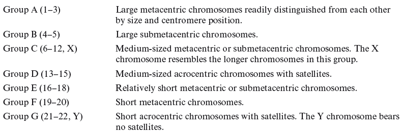

### 2.2.2 Banding 기법

Numerous technical procedures have been reported that produce banding patterns on metaphase chromosomes.

중기 염색체에 밴드 패턴을 생성하는 여러가지 기법들이 보고되어 있습니다.

A band is defined as the part of a chromosome that is clearly distinguishable from its adjacent segments by appearing darker or lighter with one or more banding techniques. Bands that stain darkly with one method may stain lightly with other methods. The chromosomes are visualized as consisting of a continuous series of light and dark bands, so that, by definition, there are no “interbands”.

밴드는 하나 이상의 밴딩 기법을 사용한 결과로 나타나는 상대적으로 어둡거나 밝게 보여 인접한 세그먼트와 명확하게 구별되는 염색체의 부분으로 정의됩니다. 한 가지 방법으로 어둡게 염색되는 밴드가 다른 방법으로는 밝게 염색될 수 있습니다. 염색체들은 연속적인 일련의 밝고 어두운 띠로 시각화되므로, 정의상으로는 "interbands"가 없습니다.

The methods first published for demonstrating bands along the chromosomes were those that used quinacrine mustard or quinacrine dihydrochloride to produce a fluorescent banding pattern. These methods are named Q-staining methods and the resulting bands Q-bands (Fig. 1). The numbers assigned to each chromosome were based on the Q-banding pattern as given by Caspersson et al. (1972). Techniques that demonstrate an almost identical pattern of dark and light bands along the chromosomes usually use the Giemsa dye mixture as the staining agent. These techniques are generally termed G-staining methods and the resulting bands G-bands (Fig. 2). Some banding techniques give patterns that are opposite in staining intensity to those obtained by the G-staining methods, viz, the reverse staining methods, and the resulting bands are called R-bands (Fig. 3).

염색체에 존재하는 밴드를 확인하기 위해 처음 발표된 방법은 형광 밴드 패턴을 만들기 위해 quinacrine mustard 또는 quinacrine dihydrochloride를 사용한 것들 입니다. 이러한 방법은 Q-staining 방법으로 불리며, 나타나는 밴드는 Q-bands로 명명됩니다(그림 1). 각 염색체에 할당된 숫자는 Casperson 등의 연구진(1972)이 제공한 Q-banding 패턴을 기반으로 하고 있습니다. 염색체를 따라 거의 동일한 패턴의 어둡고 밝은 밴드를 보여주는 기법들은 보통 염색약으로 김자(Giemsa) 염색약 혼합물을 사용합니다. 이러한 기법은 일반적으로 G- staining 방법이라고 불리며, 그 결과 나타나는 밴드는 G-bands라고 불립니다(그림 2). 일부 banding 기법에서는 G-staining 방법에서 얻어지는 것과 반대되는 염색 강도를 보이는 패턴이 나타나며, 그 결과로 나타나는 밴드를 R-bands라고 합니다(그림 3).

> 그림1. Q-banded human karyogram. (Courtesy of Dr. E. Magenis.)
>
> 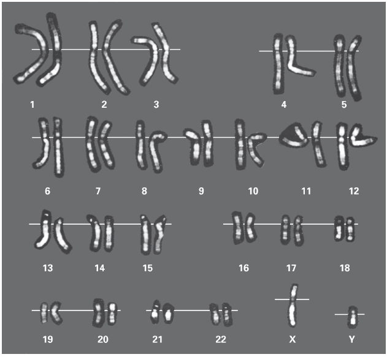

> 그림2. G-banded human karyogram. (Courtesy of N.L. Chia.)
>
> 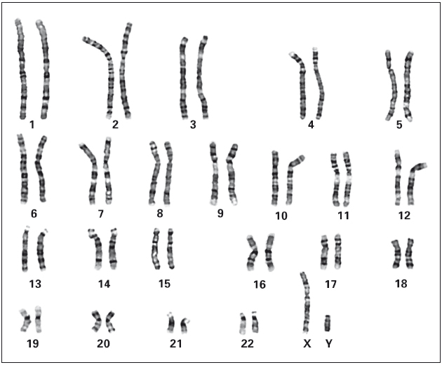

> 그림3. R-banded human karyogram. (Courtesy of Dr. M. Prieur.)
>
> 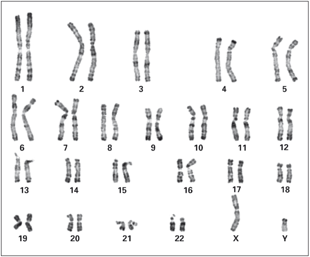

> 그림4. C-banded human karyogram. The chromosomes were not preidentified with other banding techniques. (Courtesy of Dr. N. Mandahl.)
>
> 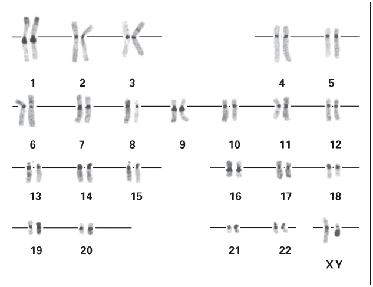

The banding techniques fall into two principle groups: (1) those resulting in bands distributed along the length of the whole chromosome, such as G-, Q-, and R-bands, including techniques that demonstrate patterns of DNA replication, and (2) those that stain specific chromosome structures and hence give rise to a restricted number of bands (Table 1). These include methods that reveal constitutive heterochromatin (C-bands) (Fig. 4), telomeric bands (**T-bands**), and nucleolus organizing regions (NORs). For the code to describe banding techniques, see Table 2.

Banding 기법은 두 가지 기본 그룹으로 나뉩니다: (1) DNA 복제 패턴을 보여주는 기법, 즉, G-, Q-, R-밴드 등과 같은 기법으로, 전체 염색체의 길이를 따라 분포하는 밴드를 만드는 기법과 (2) 염색체의 특정 구조를 염색하여 제한된 수의 밴드를 발생시키는 기법입니다(표 1). 이러한 기법에는 constitutive heterochromatin(C-bands)(그림 4), telomeric bands(T-bands), nucleolus organizing regions(NORs)을 나타내는 기법들 포함됩니다. 밴딩 기법을 설명하는 코드는 표 2에 나와 있습니다.

> 표1. Examples of heteromorphisms with various stainsa
>
> 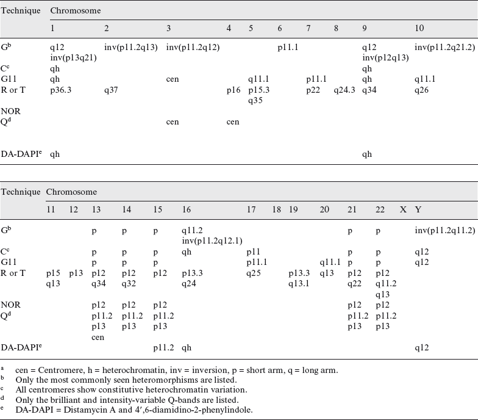

> 표2. 밴딩 기법을 설명하는 데 사용되는 코드의 예. 이 1~3 글자 코드에서 첫 번째 글자는 밴딩의 종류를 나타내고, 두 번째 글자는 일반적 기법(general technique), 세 번째 글자는 염색(stain)을 나타냅니다.
>
> 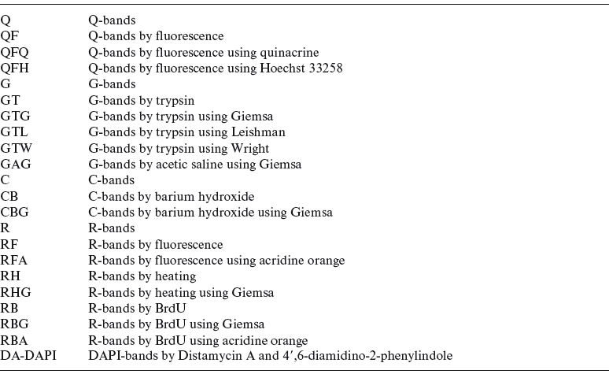

### 2.2.3 X 및 Y chromatin

Inactive X chromosomes, as well as the heterochromatic segment on the long arm of the Y chromosome, appear as distinctive structures in interphase nuclei, for which the terms X-chromatin (Barr body, sex chromatin, X-body) and Y-chromatin (Y-body), respectively, should be used.

비활성 X 염색체뿐만 아니라 Y 염색체의 장완의 heterochromatic 세그먼트도 interphase 핵에서 특유한 구조로 나타나며, 이를 각각 X-chromatin(Barr body, sex chromatin, X-body)와 Y-chromatin(Y-body)이라는 용어로 표현하여야 합니다.

## 2.3 염색체 밴드 명명법

### 2.3.1 염색체 랜드마크(landmarks), regions, bands의 식별 및 정의

Each chromosome in the human somatic cell complement is considered to consist of a continuous series of bands, with no unbanded areas. As defined earlier, a band is a part of a chromosome clearly distinguishable from adjacent parts by virtue of its lighter or darker staining intensity. The bands are allocated to various regions along the chromosome arms, and the regions are delimited by specific landmarks. These are defined as consistent and distinct morphologic features important in identifying chromosomes. Landmarks include the ends of the chromosome arms, the centromere, and certain bands. The bands and the regions are numbered from the centromere outward. A region is defined as an area of a chromosome lying between two adjacent landmarks.

인간 체세포 complement의 각 염색체는 밴드가 없는 부분이 없이 연속적인 밴드로 구성되어 있다고 간주됩니다. 앞에서 정의한 바와 같이, 밴드는 상대적으로 밝거나 어두운 염색 강도 때문에 인접한 부분과 명확하게 구별가능한 염색체의 일부입니다. 밴드는 염색체 팔을 따라 다양한 영역(regions)에 존재하고 있으며(할당되며), 영역은 특정 랜드마크에 의해 구분됩니다. 염색체를 식별하는 데 중요한 일관적이고 뚜렷한 형태학적 특징을 랜드마크라고 합니다. 랜드마크는 염색체 팔의 끝, 중심체, 그리고 특정 밴드로 구성됩니다. 밴드 및 영역은 중심에서 바깥쪽으로 번호가 매겨집니다. 영역은 두 개의 인접한 랜드마크 사이에 놓여 있는 염색체의 한 부분입니다.

The original banding pattern was described in the Paris Conference (1971) report and was based on the patterns observed in different cells stained with either the Q-, G-, or R-banding technique (Appendix, Chapter 19). The banding patterns obtained with these staining methods agreed sufficiently to allow the construction of a single diagram representative of all three techniques. The bands were designated on the basis of their midpoints and not by their margins. Intensity was taken into consideration in determining which bands should serve as landmarks on each chromosome in order to divide the chromosome into natural, easily recognizable morphologic regions. A list of bands serving as landmarks that were used in constructing this diagram is provided in Table 3.

원래의 밴딩 패턴은 파리 회의 보고서(1971)에 설명되어 있으며 Q-, G- 또는 R-banding 기법으로 염색한 서로 다른 세포에서 관찰되는 패턴을 기반으로 했습니다(부록 19장). 이러한 염색 기법을 사용하여 얻은 밴드 패턴은 세 가지 기법을 모두 대표하는 단일 다이어그램을 제작할 수 있도록 충분히 합의되었습니다. 밴드는 가장자리가 아닌 중간점을 기준으로 지정되었습니다. 염색체를 자연스럽고 쉽게 알아볼 수 있는 형태적 영역으로 나누기 위해 각 염색체에서 어떤 밴드가 랜드마크 역할을 해야 하는지 결정하는 데 있어 염색 강도를 고려했습니다. 이 다이어그램 구성에서 랜드마크 역할을 하는 밴드 목록은 표 3에 나와 있습니다.

> 표3. 염색체를 세포학적으로 정의된 영역으로 나누는 랜드마크의 역할을 하는 밴드들. 전체 염색체 또는 염색체 팔이 누락된 것은 양쪽 팔 또는 한쪽 팔이 중심체와 염색체 암의  끝 부분으로 구분되는 한 영역으로만 구성되어 있음을 나타냅니다.
>
> 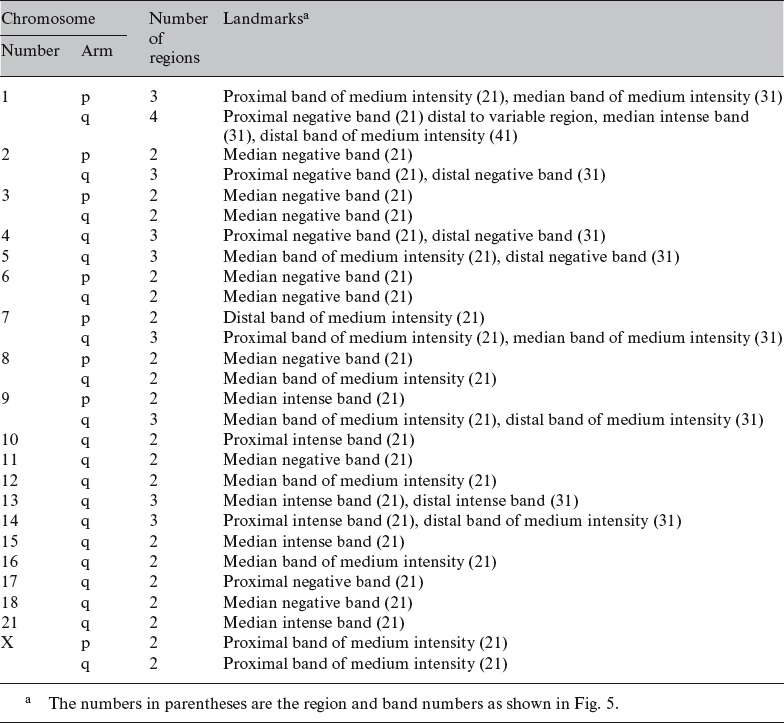

### 2.3.2 영역(regions), 밴드, 서브밴드의 지정(명명)

Regions and bands are numbered consecutively from the centromere outward along each chromosome arm. The symbols p and q are used to designate, respectively, the short and long arms of each chromosome. The centromere (cen) itself is designated 10; the part facing the short arm is p10, the part facing the long arm is q10. These are not shown in the idiograms. The two regions adjacent to the centromere are labeled as 1 in each arm; the next, more distal regions as 2, and so on. A band used as a landmark is considered as belonging entirely to the region distal to the landmark and is accorded the band number of 1 in that region.

영역과 밴드의 번호는 각 염색체 팔을 따라 중심체에서 바깥쪽 방향으로 연속적으로 매겨집니다. 기호 p와 q는 각각 각 염색체의 단완과 장완을 지정하는 데 사용됩니다. 중심체(centromere, cen) 자체는 10으로 지정되며, 단완을 향한 부분은 p10, 장완을 향한 부분은 q10입니다. 이러한 것들은 idiogram에는 나와 있지 않습니다. 중심부에 인접한 두 영역은 각 팔에 1로 표시되고, 더 원위부에 위치한 다음 영역은 2로 표시됩니다. 랜드마크로 사용되는 밴드는 랜드마크의 원위부 영역에 속하는 것으로 간주되며, 해당 지역의 밴드 번호 1을 가집니다.

In designating a particular band, four items are required: (1) the chromosome number, (2) the arm symbol, (3) the region number, and (4) the band number within that region. These items are given in order without spacing or punctuation. For example, 1p31 indicates chromosome 1, short arm, region 3, band 1.

특정 밴드를 지정하려면 (1) 염색체 번호, (2) 팔 기호, (3) 영역 번호, (4) 해당 영역 내의 밴드 번호 등 네 가지 항목이 필요합니다. 이러한 항목은 공백이나 구두점 없이 순서대로 제공됩니다. 예를 들어, 1p31은 1번 염색체, 단완, 영역 3, 밴드 1을 나타냅니다.

Whenever an existing band is subdivided, a decimal point is placed after the original band designation and is followed by the number assigned to each sub-band. The sub-bands are numbered sequentially from the centromere outward. For example, if the original band 1p31 is subdivided into three equal or unequal sub-bands, the sub-bands are labeled 1p31.1, 1p31.2, and 1p31.3, sub-band 1p31.1 being proximal and 1p31.3 distal to the centromere. If a sub-band is subdivided, additional digits, but no further punctuation, are used; e.g., sub-band 1p31.1 might be further subdivided into 1p31.11, 1p31.12, etc. Although in principle a band can be subdivided into any number of new bands at any one stage, a band is usually subdivided into three sub-bands.

기존 밴드를 세분화할 때마다 원래 밴드의 명명 뒤에 소수점이 배치되고 각 서브밴드에 할당된 번호가 추가됩니다. 서브밴드는 중심체에서 바깥쪽 방향으로 순차적으로 번호가 매겨집니다. 예를 들어, 원래 밴드 1p31이 세 개의 하위 대역으로 세분된 경우 하위 대역은 1p31.1, 1p31.2 및 1p31.3으로 표시되며, 하위 대역 1p31.1은 중심체에 대해 근위부이며 1p31.3은 중심체에 대해 원위부 입니다. 서브밴드가 다시 세분화된 경우, 추가 자릿수는 사용되지만 더 이상의 구두점은 사용되지 않습니다. 예를 들어, 하위 밴드 1p31.1은 1p31.11, 1p31.12 등으로 추가로 세분될 수 있습니다. 비록 원칙적으로 한 단계의 밴드가 여러 개의 새로운 밴드로 분할될 수 있지만, 보통 세 개의 서브 밴드로 분할됩니다.

## 2.4 고해상도 banding

The nomenclature for high-resolution preparations of prophase and prometaphase chromosomes set forth by ISCN (1981) is an extension of the nomenclature for the banding patterns for metaphase chromosomes established at the Paris Conference (1971) and in ISCN (1978). The original system was specifically devised to allow for expansion as more chromosome bands were recognized.

ISCN(1981)에 의해 설정된 prophase 및 prometaphase 염색체의 고해상도 preparation를 위한 명명법은 파리 회의(1971년)와 ISCN(1978년)에서 확립된 metaphase 염색체 밴드 패턴에 대한 명명법의 연장선입니다.  더 많은 염색체 밴드가 인식됨에 따라 원래의 시스템으로부터 확장이 가능하도록 특별히 고안되었습니다.

High-resolution banding techniques can be applied to chromosomes in different stages of the cell cycle, e.g., prophase, prometaphase, or interphase (by methods that induce premature chromosome condensation). Furthermore, the number of discernible bands depends not only on the state of condensation but also on the banding technique used. The level of resolution is determined by the number of bands seen in a haploid set (22 autosomes + X and Y). The standard idiograms shown in Fig. 5 provide schematic representations of chromosomes corresponding to approximately 300, 400, 550, 700 and 850 bands. Although larger numbers of bands can be visualized, 550- to 850-band idiograms are sufficient for practical purposes. The 400- and 550-band idiograms are taken from ISCN (1985), and the 850-band idiogram was introduced in ISCN (1981) (Francke, 1994). The original nomenclature was based on patterns rather than on measurements. Also, variation in intensity of staining, which is dependent on the staining technique, was not reflected in the ISCN (1981) idiograms. At higher resolution, however, an idiogram depicting only patterns of black and white bands becomes difficult to use. Therefore, the ISCN (1981) 850-band idiogram has been replaced by previously published idiograms that are based on measurements of trypsin-Giemsa bands on prometaphase chromosomes and include five different shades of staining intensities to facilitate orientation among the large number of bands (Francke, 1981, 1994).

고해상도 banding 기법은 세포 주기의 서로 다른 단계에서 염색체에 적용될 수 있습니다. 예를 들어, prophase, prometaphase,  interphase(염색체 조기 응축을 유도하는 방법을 사용하는 경우)입니다. 또한 식별 가능한 밴드의 수는 응축 상태뿐만 아니라 사용되는 밴딩 기법에 따라 달라집니다. 분해능 수준은 반수체 집합에 표시되는 밴드 수(22개의 autosome + X 및 Y)에 따라 결정됩니다. 그림 5에 표시된 표준 idiogram은 약 300, 400, 550, 700 및 850 밴드에 해당하는 염색체의 도식적인 표현을 제공합니다. 더 많은 수의 밴드를 시각화할 수 있지만, 실용적인 용도로는 550 ~ 850 밴드의 idiogram이면 충분합니다. 400-밴드 및 550-밴드 idiogram은 ISCN(1985)에서 가져왔고, 850-밴드 idiogram은 ISCN(1981)에서 도입되었습니다(1981) (Francke, 1994). 원래 명명법은 측정(measurement)이 아닌 패턴을 기반으로 했습니다. 또한, 염색 기법에 따라 달라지는 염색 강도 변동은 ISCN(1981) idiogram에는 반영되지 않았습니다. 하지만 고해상도에서는 흑백 밴드 패턴으로만 나타나는 idiogram의 사용이 어려워집니다. 따라서 ISCN (1981) 850-밴드 idiogram은 prometaphase 염색체의 트립신-김자 밴드 측정을 기반으로 출간된 기존 idiogram으로 대체되었으며, 여러 밴드들 사이의 orientation을 용이하게 하기 위해 5가지 다른 음영의 염색강도를 표현됩니다.(Francke, 1981, 1994).

> 그림5. 정상 인간 염색체에 대한 G-밴드 패턴 idiogram을 5가지 분해능으로 나타내었다. 왼쪽부터, 각 그룹의 염색체들은 대략 300-, 400-, 550-, 700-, 850-밴드 수준의 반수체 karyotype을 나타냅니다. 밴드의 위치 및 너비는 어떠한 측정값도 기반으로 하지 않습니다. 어두운 G-밴드는 변동적 영역(variable region)을 제외하고는 밝은 Q-밴드에 상응합니다. R-밴드 염색체의 번호는 정확히 동일하나, 밴드의 밝거나 어두운 부분이 반전됩니다. 밴드 번호는 정확히 동일하지만, euchromatic밴드의 상대적 폭은 측정을 기반으로 하며 염색 강도는 GTG 밴드를 반영합니다(Francke, 1981, 1994). Y 염색체 idiogram은 Magenis와 Barton(1987년)의 관찰에 따른 것입니다. 긴 팔의 euchromatic 부분에 있는 밴드의 수는 확장되었지만, 밝은 밴드 대 어두운 밴드의 명명은 유지되었습니다. 400-, 550- 및 850-밴드 idiogram은 ISCN(1995) 명명법에 해당합니다. ISCN(2005년)의 새로운 300-밴드 및 700-밴드 idiogram는 N.L. Chia에 의해 제공되었습니다.
>
> 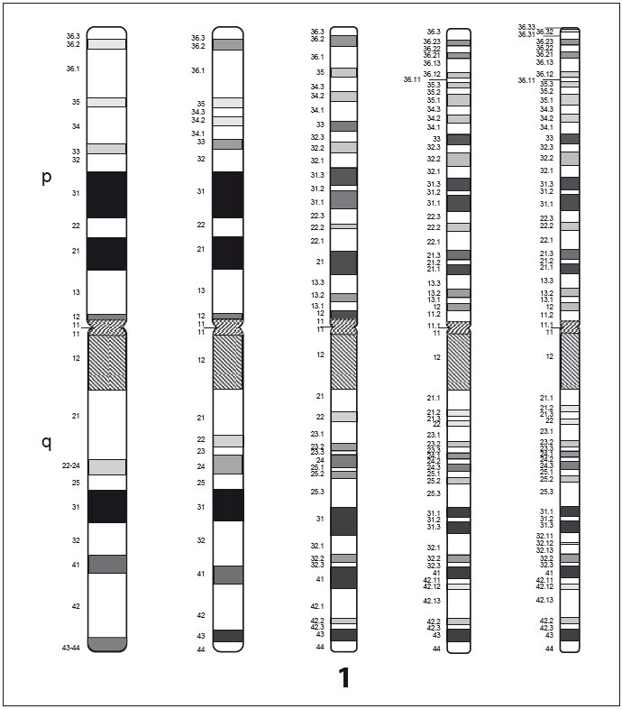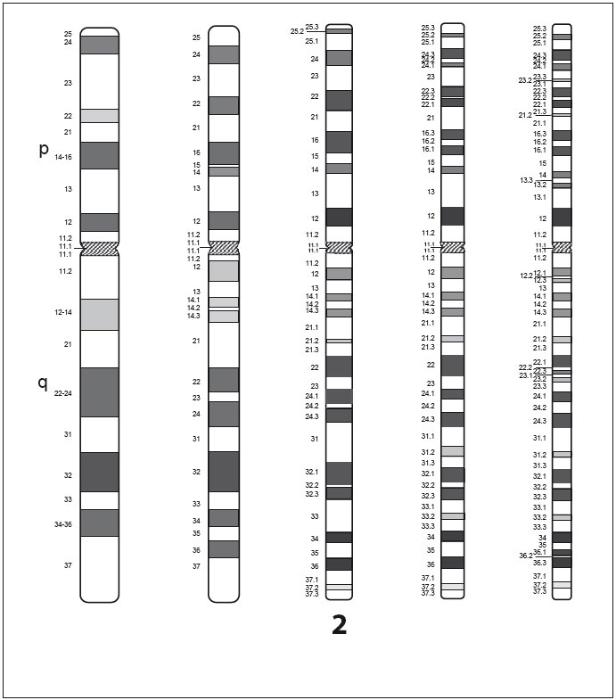
> 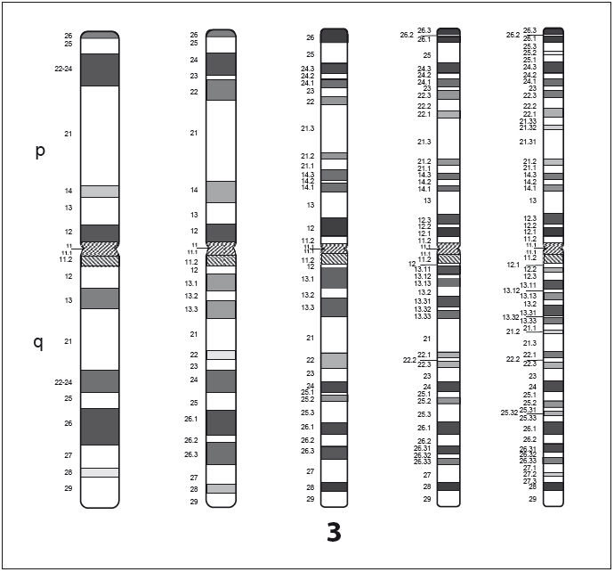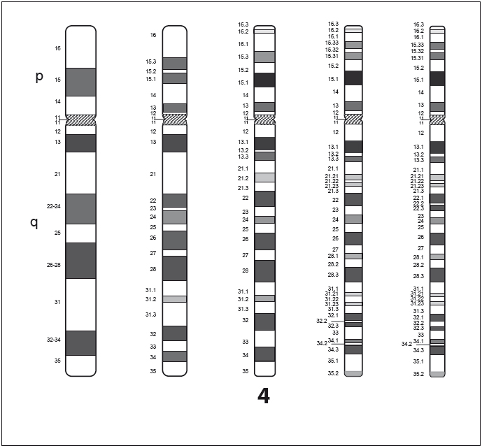
> 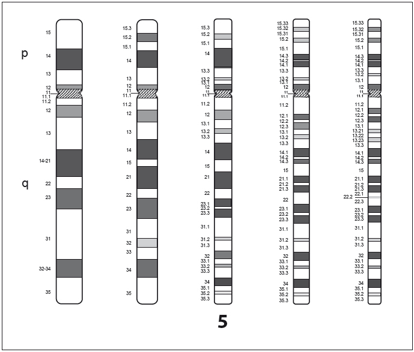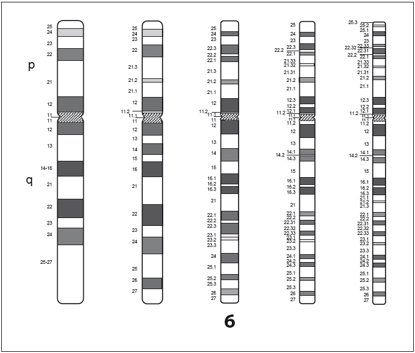
> 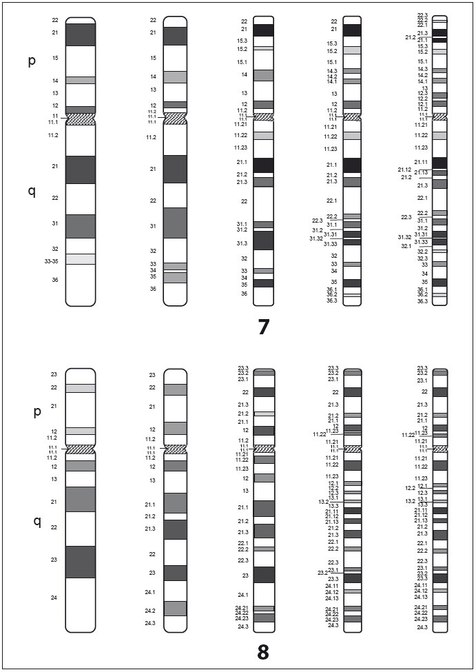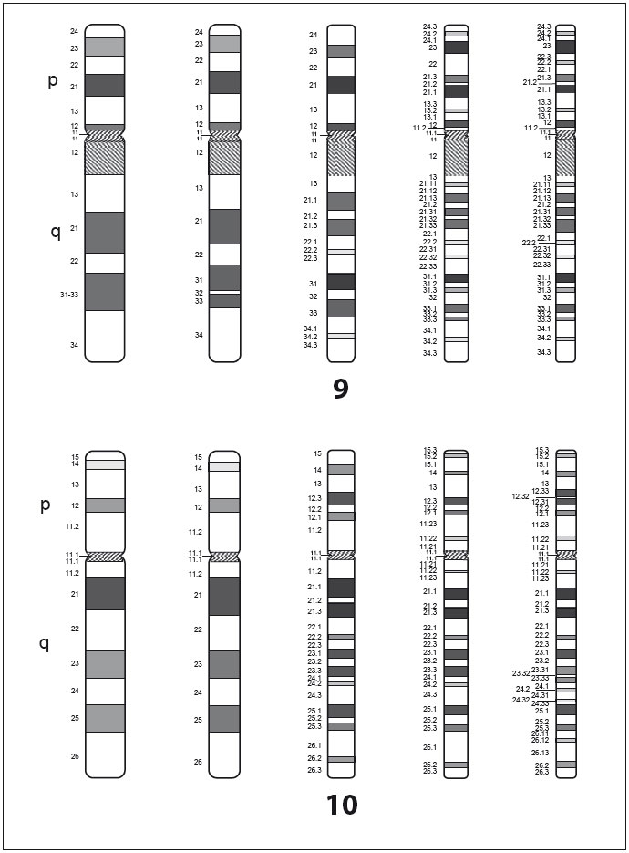
> 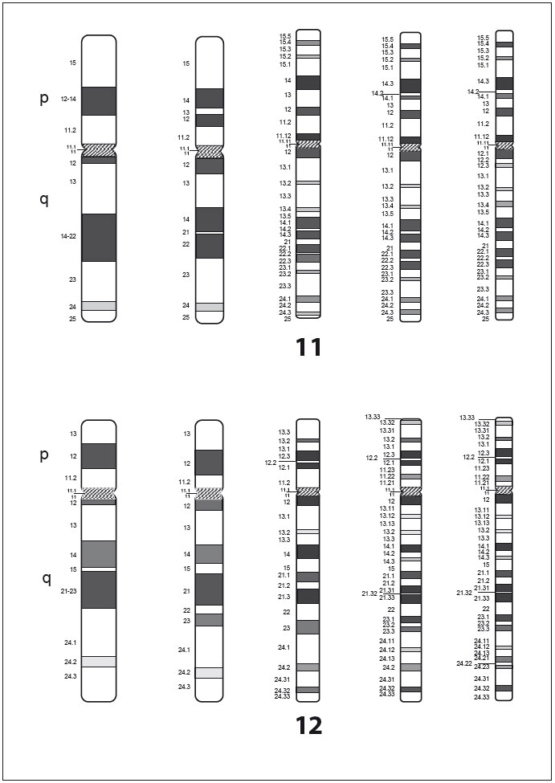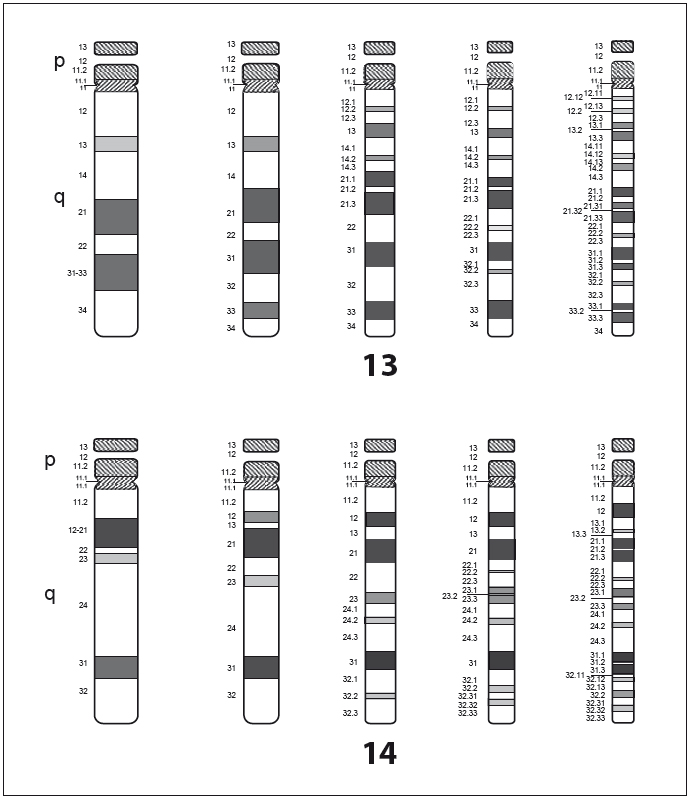
> 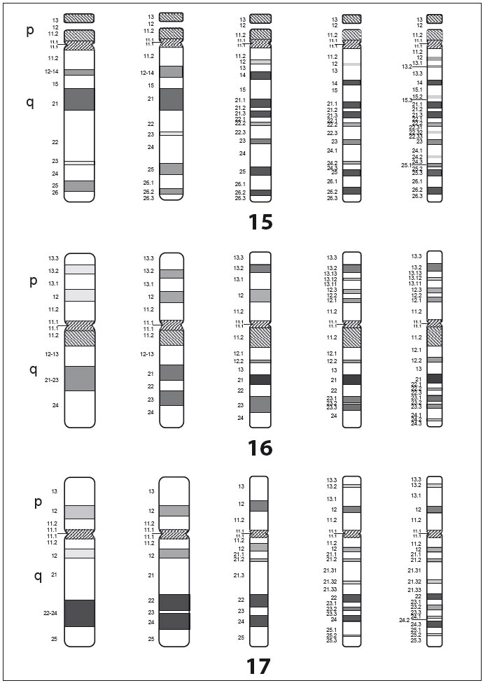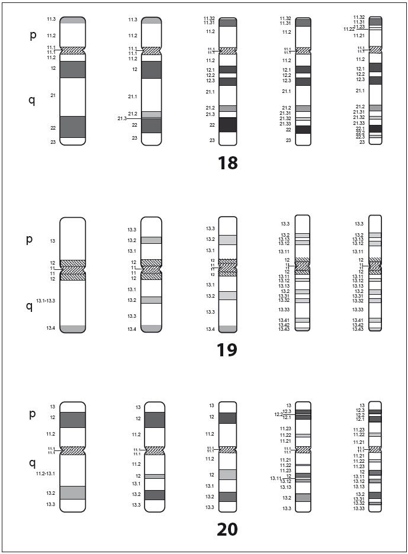
> 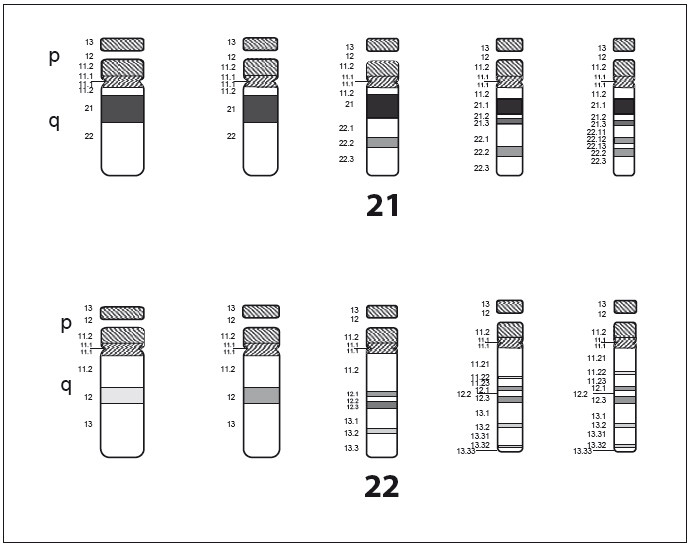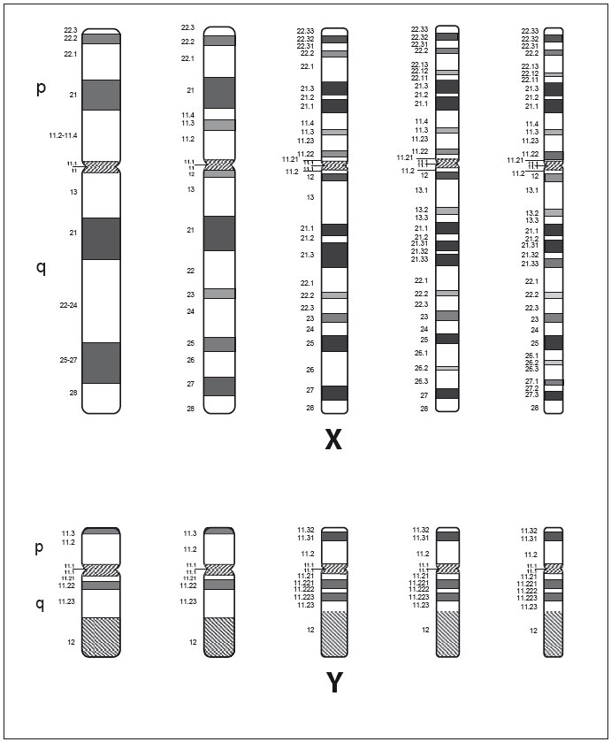

The ISCN (2005) added the 300- and 700-band idiograms as additional references. The idiograms, which show a G-band pattern, are provided to represent the position of bands in G-, Q- and R-stained preparations. Although the appearance of bands visualized by G-staining may differ from that revealed by R-staining (Fig. 6), the sequence of the bands is the same.

ISCN(2005)은 300- 및 700-밴드 idiogram을 레퍼런스로 추가했습니다. G-밴드 패턴을 보여주는 idiogram은  G-, Q-, R-염색에서 밴드의 위치를 나타내기 위해 제공됩니다. G-염색에 의해 시각화된 밴드의 외관은 R-염색에 의해 나타난 것과 다를 수 있지만(그림 6), 밴드의 순서는 동일합니다.

> 그림6. (a) G-밴드 염색체는 약 500-밴드에서 900-밴드 분해능의 순서로 배열됩니다.  (Courtesy of Dr. E. Magenis.)
>
> 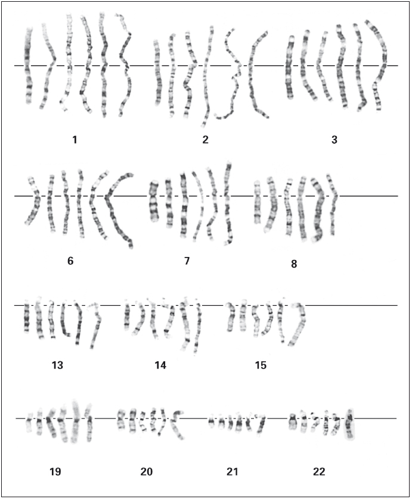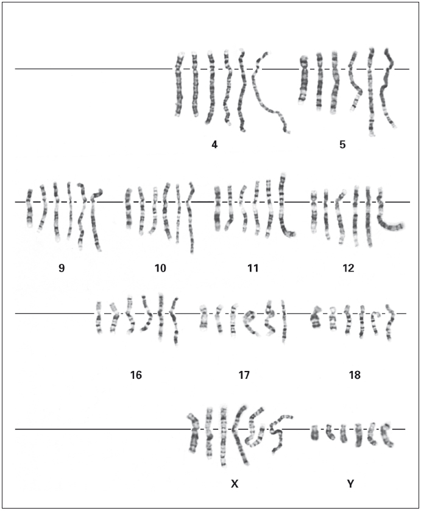
> (b) R-밴드 염색체는 약 400-밴드에서 850-밴드 분해능의 순서로 배열됩니다. (Courtesy of Dr. E. Magenis.)
> 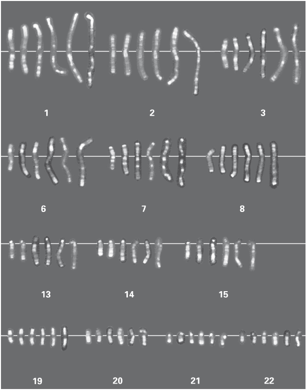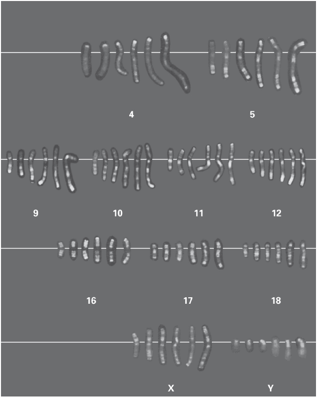

Two kinds of variable regions are indicated by different cross-hatching patterns, one involving the pericentromeric heterochromatin regions on all chromosomes and the other involving the variable regions 1q12, 3q11.2, 9q12, 16q11.2, 19p12, 19q12, Yq12, and the short arms of all acrocentric chromosomes. The representations of these variable regions are not based on measurements. Banded structures can be seen within the variable regions, in particular in 1q12, 9q12 and Yq12, but since they are variable they have not been detailed in the idiograms. Normal chromosome variants are discussed in more detail in Chapter 7.

두 종류의 가변 영역은 서로 다른 cross-hatching 패턴으로 표시되는데, 하나는 모든 염색체에 있는 pericentromeric heterochromatin 영역을 포함하고 다른 하나는 가변 영역 1q12, 3q11.2, 9q12, 16q11.2, 19p12, 19q12, Yq12, 및 모든 acrocentric 염색체의 단완을 포함합니다. 이러한 가변 영역의 표현은 측정을 기반으로 하지 않습니다. 밴드형 구조는 특히 1q12, 9q12 및 Yq12에서 가변 영역 내에서 볼 수 있지만, 가변적이기 때문에 idiogram에는 자세히 설명되지 않았습니다. 정상적인 염색체 변이체는 7장에 더 자세히 설명되어 있습니다.

The lowest band number of 10 is assigned to the centromere (not shown on idiograms). The adjacent heterochromatic regions carry band designations of 11, 11.1 or 11.11 depending on the level of resolution.

가장 낮은 밴드 번호인 10이 중심체에 할당됩니다(idiogram에는 표시되지 않음). 인접한 이염색 영역에는 분해능 수준에 따라 11, 11.1 또는 11.11의 밴드가 명명됩니다.

One problem in assigning numbers to euchromatic sub-bands is that in G-banded preparations new G-bands appear to arise by subdivision of darkly stained G-bands on less extended chromosomes, while in R-staining preparations the dark R-bands appear to split. These interpretations of band to sub-band relationships would lead to different number assignments. Therefore, in assigning sub-band numbers, arbitrary decisions were made for the purposes of nomenclature only that should not be interpreted as statements about chromosome physiology. Examples of G- and R-banded chromosomes at successive stages of resolution are shown in Fig. 6a and b. In addition, G- and R-banded metaphase chromosomes at approximately the 550-band level and their diagrammatic representation (modified from ISCN 1985) are illustrated in a detachable foldout on the inside of the backcover.

Euchromatin 서브밴드에 숫자를 할당하는 데 있어 한 가지 문제는 G-밴드 preparation에서는 덜 확장된 염색체에 어둡게 염색된 G-밴드를 분할하여 새로운 G-밴드를 세분화하는 반면 R-statining preparation에서는 어두운 R-밴드가 분리되는 것처럼 보인다는 것입니다. 이러한 밴드 대 서브밴드 관계에 대한 해석은 서로 다른 번호의 할당으로 이어질 수 있습니다. 따라서, 서브밴드 번호를 할당함에 있어서, 임의의 결정은 명명을 위한 목적으로만 이루어졌으며, 염색체의 생리학에 대한 진술로 해석하면 안 됩니다. 여러 분해능 단계에서 G- 및 R-밴드 염색체의 예는 그림 6a와 b에 나와 있습니다. 또한 약 550-밴드 수준의 G- 및 R-밴드 metaphase 염색체 및 그 도식 표현(ISCN 1985에서 수정)은 뒷표지 안쪽에 분리 가능한 접이식 페이지에 설명되어 있습니다.

## 2.5 분자 기반 Banding

Chromosome bands reflect the functional organization of the genome that regulates DNA replication, repair, transcription, and genetic recombination. The bands are large structures, each approximately 5 to 10 megabases of DNA that may include hundreds of genes. The molecular basis of banding methods is known to involve nucleotide base composition, associated proteins, and genome functional organization. In general, Giemsa-positive bands (G-dark bands, R-light bands) are AT-rich, late replicating, and gene poor; whereas, Giemsa-negative bands (G-light bands, R-dark bands) are CG-rich, early replicating, and relatively gene rich.

염색체 밴드는 DNA 복제, 수리, 전사, 유전자 재조합을 조절하는 게놈의 기능적 구성을 반영합니다. 이 밴드들은 각각 수백 개의 유전자를 포함할 수 있는 약 5에서 10메가베이스로 구성된 DNA의 큰 구조입니다. 분자 기반 banding은 핵산 염기의 구성, 관련 단백질, 게놈 기능 구성과 관련된 것으로 알려져 있습니다. 일반적으로 Giemsa 양성 밴드(G-dark bands, R-light bands)는 AT-rich, late replication, 유전자들이 적은 반면, Giemsa 음성 밴드(G-light bands, R-dark bands)는 CG-rich, early replicating, 상대적으로 유전자들 많이 위치합니다.

Centromeric DNA and pericentromeric heterochromatin, composed of α-repetitive DNA and various families of repetitive satellite DNA, are easily detected by C-banding. The telomere is composed of 5 to 20 kb of tandem hexanucleotide minisatellite repeat units, TTAGGG, and stains darkly by T-banding. The 18S and 28S ribosomal RNA genes are clustered together in large arrays containing about 40 copies of each gene. These are located on the acrocentric short arms, at the nucleolar organizer regions or NORs, and are detected by silver staining.

α-반복적인 DNA와 다양한 패밀리의 반복적인 위성 DNA로 구성된 centromeric DNA와 pericentromeric heterochromatin은 C-밴딩에 의해 쉽게 검출됩니다. 텔로미어는 탠덤 헥사뉴클레오티드 미니위성 반복장치인 TTAGGG로 5~20kb로 구성되며, T-밴드 기법에 의해 어두운 염색으로 나타납니다. 18S와 28S 리보솜 RNA 유전자는 각 유전자의 약 40개의 복제본이 들어 있는 큰 배열로 함께 모여 있습니다. 이들은 NOR(nucleolar organizer regions)의 acrocenteric 단완에 위치하며.  은(silver) 염색에 의해 감지됩니다.

# 3 기호 및 약어

All symbols and abbreviated terms used in the description of  chromosomes and chromosome abnormalities are listed below. Section  references are given within parentheses for terms that are defined in  greater detail in the text. When more than one symbol or abbreviation is used together, a space is placed between the two (e.g. psu dic). When  the symbol or abbreviation precedes the total number of chromosomes and  no parenthesis is present, a space is placed between the symbol or  abbreviation and the number of chromosomes (e.g. mos  47,XXX[25]/46,XX[5]). There is no space when a symbol or abbreviation  immediately precedes or follows a parenthesis.

염색체 및 염색체 이상에 대한 설명에 사용되는 모든 기호 및 약어가 다음에 나와 있습니다. 괄호 안의 번호는 해당 용어에 대한 보다 상세한 정의가 실려있는 챕터 번호입니다. 둘 이상의 기호나 약어를 함께 사용할 경우 둘 사이에 공간이 배치됩니다(예: psu dic). 기호나  약어가 총 염색체 수보다 앞에 있고 괄호가 없으면 기호나 약어와 염색체 수(예: mos 47,XX[25]/46,XX[5]) 사이에 공간이 배치된다. 기호나 약어가 괄호 바로 앞에 있거나 뒤에 있을 때는 공백이 없습니다.

| 기호 및 약어            | 의미                                                         |
| ----------------------- | ------------------------------------------------------------ |
| AI                      | First meiotic anaphase (12.1) 1차 감수분열 후기         |
| AII                     | Second meiotic anaphase (12.1) 2차 감수분열 후기        |
| ace                     | Acentric fragment (9.2.12, 10.2.1) 중심체가 없는 염색체의 한 부분 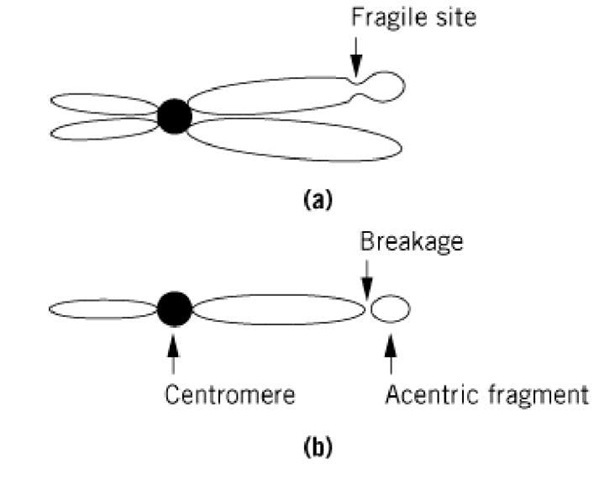 |
| add                     | Additional material of unknown origin (9.2.1, 16.2) 출처를 알 수 없는 추가적인 물질(염색질) |
| amp                     | Denotes an amplified signal (13.3.2) 증폭 신호 표시     |
| approximate sign (~)    | Denotes intervals and boundaries of a chromosome  segment or number of chromosomes, fragments, or markers (5.2); denotes a range of number of copies of a chromosomal region when the exact number cannot be determined (14.2) 염색체 부분 또는 염색체, 단편 또는 마커의 번호(5.2)의 간격과 경계를 나타내며, 정확한 번호를 확인할 수 없을 때는 염색체 영역의 copy number 범위를 나타낸다(14.2). |
| arr                     | Microarray (14.2)                                            |
| arrow ( → or ->)        | From – to, in detailed system (4.3.2.1) 상술형 표기에서 사용하는 기호로, ~부터 ~까지를 의미 |
| b                       | Break (10.1.1, 10.2.1)                                       |
| brackets, angle (< >)   | Surround the ploidy level (8.1)                              |
| brackets, square ([ ])  | Surround number of cells or genome build (4.1, 11.1.2, 14)   |
| c                       | Constitutional anomaly (4.1, 8.3, 11.3) 선천적 이상     |
| cen                     | Centromere (2.3.2, 4.3.2.1, 16.2)                            |
| cgh                     | Comparative genomic hybridization (13.6) 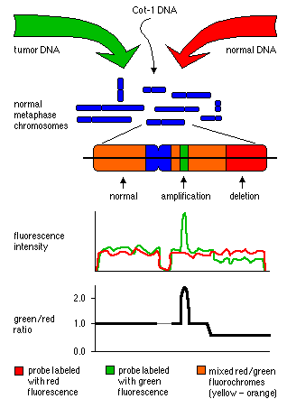 |
| chi                     | Chimera (4.1)                                                |
| chr                     | Chromosome (10.2)                                            |
| cht                     | Chromatid (10.1)                                             |
| colon, single (:)       | Break, in detailed system (4.3.2.1)                          |
| colon, double (::)      | Break and reunion, in detailed system (4.3.2.1, 16.2)        |
| comma (,)               | Separates chromosome numbers, sex chromosomes, and  chromosome abnormalities (4.1, 14.2); separates locus designations  (13.2, 13.3.1) |
| con                     | Connected signals (13.3.2)                                   |
| cp                      | Composite karyotype (11.1.5)                                 |
| cth                     | Chromothripsis (14.2.2)                                      |
| curly braces ({ })      | Indicate differences in the altered segment compared to the reference sequence in duplications, inversions, conversions,  insertions, etc. (16.2) |
| cx                      | Complex rearrangements (10.1.1, 14.2.2)                      |
| decimal point (.)       | Denotes sub-bands (2.3.2)                                    |
| del                     | Deletion (9.2.2, 16.3.1)                                     |
| der                     | Derivative chromosome (4.4, 9.2.3, 9.2.17.2, 9.2.17.3, 16.3.2) |
| dia                     | Diakinesis (12.1)                                            |
| dic                     | Dicentric (9.2.4)                                            |
| dim                     | Diminished (13.2.1, 13.5)                                    |
| dip                     | Diplotene (12.1)                                             |
| dis                     | Distal (12.1)                                                |
| dit                     | Dictyotene (12.1)                                            |
| dmin                    | Double minute (9.2.12, 10.2.1) 일종의 조그마한 염색체 절편 (extrachromosomal DNA)으로 현미경 상에서는 쌍으로 형성된 점 모양의 구조로 보인다. 정상 염색체와 달리 DNA 절편이 환형으로 꼬여있는 형태이며, 중심체나 텔로미어가 없다. |
| dn                      | Designates a chromosome abnormality that has not been inherited (de novo) (4.1) |
| dup                     | Duplication (9.2.5, 16.3.3)                                  |
| e                       | Exchange (10.1.1, 10.2.1)                                    |
| end                     | Endoreduplication (4.1)                                      |
| enh                     | Enhanced (13.2.1, 13.5)                                      |
| equal sign (=)          | Number of chiasmata (12.1)                                   |
| fem                     | Female (12.1)                                                |
| fib                     | Extended chromatin/DNA fiber (13.4)                          |
| fis                     | Fission, at the centromere (9.2.6)                           |
| fra                     | Fragile site (7.2, 9.2.7)                                    |
| g                       | Gap (10.1.1, 10.2.1)                                         |
| GRCh                    | Genome Reference Consortium human; human genome build or assembly (4.3, 14, 15, 16) |
| h                       | Heterochromatin, constitutive (7.1.1)                        |
| hmz                     | Homozygous, homozygosity; used when one or two  copies of a genome are detected, but previous, known heterozygosity has  been reduced to homozygosity through a variety of mechanisms, e.g. loss  of heterozygosity (LOH) (14.2.1) |
| hsr                     | Homogeneously staining region (9.2.8)                        |
| htz                     | Heterozygous, heterozygosity (14.2.1)                        |
| i                       | Isochromosome (9.2.11)                                       |
| idem                    | Denotes the stemline karyotype in a subclone (11.1.4)        |
| ider                    | Isoderivative chromosome (9.2.3)                             |
| idic                    | Isodicentric chromosome (9.2.4, 9.2.11)                      |
| inc                     | Incomplete karyotype (5.4)                                   |
| inh                     | Inherited (4.1)                                              |
| ins                     | Insertion (9.2.9, 16.3.4)                                    |
| inv                     | Inversion (9.2.10, 16.2, 16.3.5)                             |
| ish                     | In situ hybridization; when used without a prefix applies to metaphase or prometaphase chromosomes of dividing cells (13.2) |
| lep                     | Leptotene (12.1)                                             |
| MI                      | First meiotic metaphase (12.1)                               |
| MII                     | Second meiotic metaphase (12.1)                              |
| mal                     | Male (12.1)                                                  |
| mar                     | Marker chromosome (9.2.12) 일반적으로 절편의 크기 때문에 특별한 유전학적 분석 없이는 식별할 수 없는 염색체의 작은 절편입니다. |
| mat                     | Maternal origin (4.1)                                        |
| med                     | Medial (12.1)                                                |
| min                     | Minute acentric fragment (10.2.1)                            |
| minus sign (–)          | Loss (4.1, 8.1); decrease in length (7.1.1); locus absent from a specific chromosome (13.2) |
| mos                     | Mosaic (4.1)                                                 |
| multiplication sign (x) | Multiple copies of rearranged chromosomes (9.3);  designates aberrant polyploidy clones in neoplasias (11.1.4); with  number to indicate number of signals seen (13.2, 13.3.1); multiple  copies of a chromosome or chromosomal region (14.2) |
| neg                     | No presence of the rearrangement for which testing was conducted (15.3) |
| neo                     | Neocentromere (9.2.13)                                       |
| nuc                     | Nuclear or interphase (13.3)                                 |
| oom                     | Oogonial metaphase (12.1)                                    |
| or                      | Alternative interpretation (5.3)                             |
| p                       | Short arm of chromosome (2.3.2)                              |
| PI                      | First meiotic prophase (12.1)                                |
| pac                     | Pachytene (12.1)                                             |
| parentheses ( )         | Surround structurally altered chromosomes and  breakpoints (4.1); surround chromosome numbers, X, and Y in normal and  abnormal results; surround coordinates (or nucleotide positions) in  abnormal result (14.2) |
| pat                     | Paternal origin (4.1)                                        |
| pcc                     | Premature chromosome condensation (10.2.1)                   |
| pcd                     | Premature centromere division (10.2.1)                       |
| pcp                     | Partial chromosome paint (13.8)                              |
| period (.)              | Separates various techniques (13.2, 14.2, 16.2, 16.3)        |
| Ph                      | Philadelphia chromosome (9.2.3)                              |
| plus sign, single (+)   | Additional normal or abnormal chromosomes (4.1, 8.1); increase in length (7.1.1); locus present on a specific chromosome (13.2) |
| plus sign, double (++)  | Two hybridization signals or hybridization regions on a specific chromosome (13.2) |
| pos                     | Detection of a rearrangement for which testing was conducted (15.3) |
| prx                     | Proximal (12.1)                                              |
| ps                      | Satellited short arm of chromosome (7.1.1, 7.1.2)            |
| psu                     | Pseudo- (9.2.4)                                              |
| pter                    | Terminal end of the short arm                                |
| pvz                     | Pulverization (10.2.1)                                       |
| q                       | Long arm of chromosome (2.3.2)                               |
| qdp                     | Quadruplication (9.2.14)                                     |
| qr                      | Quadriradial (10.1.1)                                        |
| qs                      | Satellited long arm of chromosome (7.1.1, 7.1.2)             |
| qter                    | Terminal end of the long arm                                 |
| question mark (?)       | Questionable identification of a chromosome or chromosome structure (5.1) |
| r                       | Ring chromosome (9.2.15, 16.3.6)                             |
| rec                     | Recombinant chromosome (4.5, 9.2.3)                          |
| rev                     | Reverse, including comparative genomic (13.5)                |
| rob                     | Robertsonian translocation (9.2.17.3)                        |
| Roman numerals I–IV     | Indicate univalent, bivalent, trivalent, and quadrivalent structures (12.1) |
| rsa                     | Region-specific assay (15)                                   |
| s                       | Satellite (7.1.1, 7.1.2) 염색체의 끝부분에 섬유 구조로 연결된 타원형의 염색 소립체 |
| sce                     | Sister chromatid exchange (10.1.1)                           |
| sdl                     | Sideline (11.1.4)                                            |
| semicolon (;)           | Separates altered chromosomes and breakpoints in  structural rearrangements involving more than one chromosome (4.1,  4.3.1, 12.1); separates probes on different derivative chromosomes  (13.2) |
| sep                     | Separated signals (13.3.2)                                   |
| seq                     | Sequencing (16.2, 16.3)                                      |
| sl                      | Stemline (11.1.4)                                            |
| slant line, single (/)  | Separates clones (4.1, 11.1.1, 11.1.6, 11.3), or contiguous probes (13.2, 13.3) |
| slant line, double (//) | Separates chimeric clones (4.1, 13.3.1)                      |
| spm                     | Spermatogonial metaphase (12.1)                              |
| stk                     | Satellite stalk (7.1.1, 7.1.2)                               |
| subtel                  | Subtelomeric region (13.2.2)                                 |
| t                       | Translocation (9.2.17, 16.3.7)                               |
| tas                     | Telomeric association (9.2.16)                               |
| ter                     | Terminal (end of chromosome) or telomere (4.3.2.1)           |
| tr                      | Triradial (10.1.1)                                           |
| trc                     | Tricentric chromosome (9.2.18)                               |
| trp                     | Triplication (9.2.19)                                        |
| underlining (single)    | Used to distinguish homologous chromosomes (4.1, 9.2.3, 9.2.17.1) |
| underscore (_)          | Used to indicate range of nucleotide positions (14.1, 15.1, 16.2) |
|                         |                                                              |
| upd                     | Uniparental disomy (8.4, 14.2.1)                             |
| var                     | Variant or variable region (2.4, 7.1)                        |
|                         |                                                              |
| wcp                     | Whole chromosome paint (13.2)                                |
| xma                     | Chiasma(ta) (12.1)                                           |
| zyg                     | Zygotene (12.1)                                              |

# 4 Karyotype 표현

## 4.1 일반 원칙

In the description of a karyotype the first item to be recorded is  the total number of chromosomes, including the sex chromosomes, followed by a comma (**,**). The sex chromosome  constitution is given next. The autosomes are specified only when an  abnormality is present. Thus, the normal human karyotype is designated  as follows:

Karyotype에 대한 설명에서 가장 먼저 기록되는 항목은 성염색체를 포함한 염색체의 총 개수이며, 쉼표(,)로 구분한 후 성 염색체를 다음에 표시합니다. Autosome은 이상이 있을 때만 표기합니다. 따라서 정상적인 인간 karyotype은 다음과 같이 지정됩니다.

+ 46,XX Normal female 
+ 46,XY Normal male

In the description of chromosome abnormalities, sex chromosome  aberrations are presented first, followed by abnormalities of the  autosomes listed in numerical order irrespective of aberration type.  Each abnormality is separated by a comma. Details regarding the order of chromosome abnormalities are presented in Chapter 6.

염색체 이상에 대한 설명에서는 성 염색체 이상을 먼저 표시하고, 그 다음으로는 이상의 유형에 관계없이 번호 순으로 autosome의 이상을 열거합니다. 각각의 이상은 쉼표로 구분됩니다. 염색체 이상을 표시하는 순서에 대한 자세한 내용은 6장에 나와 있습니다.

Letter designations are used to specify rearranged (i.e.,  structurally altered) chromosomes. All symbols and abbreviations used to designate chromosome abnormalities are listed in Chapter 3. In single  chromosome rearrangements, the chromosome involved in the change is  specified within parentheses **( )**  immediately following the symbol identifying the type of rearrangement,  e.g., inv(2), del(4), r(18). If two or more chromosomes have been  altered, a semicolon (**;**) is used to  separate their designations. If one of the rearranged chromosomes is a  sex chromosome, then it is listed first; otherwise, the chromosome  having the lowest number is always specified first, e.g., t(X;3) or  t(2;5). An exception to this rule involves certain three-break  rearrangements in which part of one chromosome is inserted at a point of breakage in another chromosome. In this event, the receptor chromosome  is specified first, regardless of whether it is a sex chromosome or an  autosome with a number higher or lower than that of the donor  chromosome, e.g., ins(5;2). For details, see Section 9.2.9.

문자 표현(designations)은 재배열된(즉, 구조적으로 변형된) 염색체를 표현하는 데 사용됩니다. 염색체 이상을 표현하는 데 사용되는 모든 기호와 약어는 3장에 나열되어 있습니다. 단일 염색체 재배열에서, 변경에 관여하는 염색체는 재배열의 유형을 식별하는 기호 바로 뒤에 괄호 **( )** 를 사용하여 괄호 안에 명시됩니다(예: inv(2), del(4), r(18)). 두 개 이상의 염색체가 변경된 경우 세미콜론(;)을 사용하여 표현을 분리합니다. 재배열된 염색체 중 하나가 성염색체이면 먼저 나열되고, 그렇지 않으면 가장 낮은 번호의 염색체를 항상 먼저 표현합니다 (예: t(X;3) 또는 t(2;5)). 이 규칙의 예외는 한 염색체의 일부가 다른 염색체의 breakage 지점에 삽입되는 특정한 세 조각의 재배열인 경우입니다. 이 경우, 성 염색체이든, 공여자의 염색체보다 염색체 번호가 높거나 낮은 autosome이든지에 관계없이 수여자의 염색체를 먼저 표현합니다 (예: ins(5;2)). 자세한 내용은 9.2.9절에 나와 있습니다.

For balanced translocations involving three separate chromosomes,  with one breakpoint in each chromosome, the rule is still followed that  the sex chromosome or autosome with the lowest number is specified  first. The chromosome listed next is the one that receives a segment  from the first chromosome, and the chromosome specified last is the one  that donates a segment to the first listed chromosome. The same rule is  followed in four-break and more complex balanced translocations (see  also Section 9.2.17.1). In order to distinguish homologous chromosomes,  one of the numerals may be underlined (**single underlining**). The derivative chromosomes produced by reciprocal translocations should be described using the conventions outlined in Section 9.2.3.

각각 하나의 breakpoint를 가지는 세 개의 분리된 염색체들이 관여하는 balanced translocation(균형 전좌)의 경우, 여전히 성 염색체나 가장 낮은 번호의 autosome을 먼저 명시하는 규칙이 지켜집니다. 그 다음 명시되는 염색체는 첫 번째 염색체에서 한 부분을 받는 염색체이고, 마지막으로 명시되는 염색체는 한 부분을 첫 번째 염색체에 공여하는 염색체입니다. 4개의 break 또는 보다 복잡한 balanced translocation에서도 동일한 규칙이 적용됩니다(9.2.17.1절 참조). Homologous 염색체를 구별하기 위해 숫자 중 하나에 밑줄이 그어질 수 있습니다(single underlining). Reciprocal translocation(상호 전좌)에 의해 생성된 파생(derivative) 염색체는 9.2.3절에 설명된 규칙을 사용하여 표기하여야 합니다.

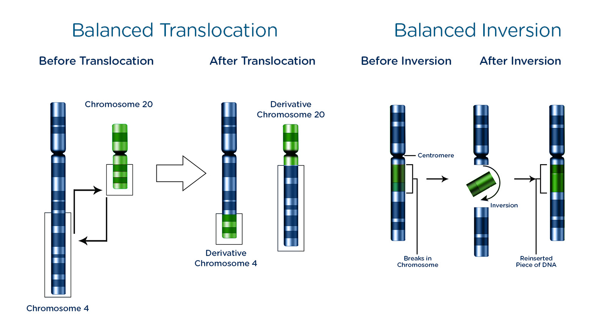

A plus (+) or minus (–) sign is placed before a chromosome or an abnormality designation to  indicate additional or missing, normal or abnormal chromosomes, e.g.,  +21, –7, +der(2); for details, see Section 8.1. The + or – sign placed  after a chromosome arm symbol (p or q) may be used in text to indicate  an increase or decrease in the length of a chromosome arm (e.g., 4p+,  5q–) but should not be used in the description of karyotypes. See also  Sections 9.2.1 and 9.2.2. Variations in length of heterochromatic  segments, satellites, and satellite stalks are distinguished from  increases or decreases in arm length as a result of other structural  alterations by placing a plus or minus sign after the appropriate symbol for these normal variable chromosome features (see Section 7.1). The  use of + and – signs in the description of results obtained by in situ  hybridization is described in Chapter 13.

더하기(+) 또는 빼기(–) 기호는 염색체 또는 이상 명칭 앞에 배치되어 추가 또는 누락(missing), 정상 또는 비정상 염색체를 나타냅니다(예: +21, –7, +der(2). 자세한 내용은 8.1절 참조). 염색체 팔 기호(p 또는 q) 뒤에 + 또는 – 기호를 표기하여 염색체 팔 길이의 증가 또는 감소를 나타내는 텍스트(예: 4p+, 5q–)로 사용은 할 수 있지만 karyotype의 설명 시에는 이와 같은 표기를 사용해서는 안 됩니다. 9.2.1 및 9.2.2절을 참조하시기 바랍니다. Heterochromatic 세그먼트, 위성 및 setellite stalks의 길이 변화는 정상 염색체를 나타내는 다양한 기호 뒤에 + 또는 - 기호를 표기함으로써 다른 구조 변화로 인해 나타나는 팔 길이의 증가 또는 감소와 구별합니다(섹션 7.1 참조). In situ hybridization을 통해 얻은 결과를 설명할 때 + 및 – 기호를 사용하는 방법은 13장에 설명되어 있습니다.

When normal chromosomes are replaced by structurally altered  chromosomes, the normal ones should not be recorded as missing (see  Section 9.1). In the description of karyotypes containing dicentric  chromosomes or derivative chromosomes resulting from whole-arm  translocations, the abnormal chromosomes by convention replace both  normal chromosomes involved in the formation of the dicentric chromosome or derivative chromosome. Thus, in these situations the two missing  chromosomes are not specified (see Sections 9.2.4 and 9.2.17.2).

정상 염색체가 구조적으로 변형된 염색체로 대체될 때, 정상 염색체를 누락(missing)된 것으로 기록해서는 안 됩니다(9.1절 참조). Dicentric 염색체 또는 팔 전체의 전좌에서 비롯된 파생성 염색체를 표현하는 karyotype에서, 관습적으로 dicentric 염색체나 derivative 염색체의 형성에 관여하는 정상 염색체가 모두 비정상 염색체로 대체됩니다. 따라서 이러한 상황에서, 누락된 두 염색체는 명시되지 않습니다 (9.2.4 및 9.2.17.2절 참조).

The multiplication sign (×) can be used to describe  multiple copies of a rearranged chromosome but should not be used to  denote multiple copies of normal chromosomes (see Section 9.3).

곱셈 기호(×)는 재배열된 염색체의 여러 복사본을 설명할 때 사용할 수 있으나, 정상 염색체의 여러 복사본을 나타내는 데 사용해서는 안 됩니다(9.3절 참조).

Uncertainty in chromosome or band designation may be indicated by a question mark (?) or an approximate sign (~). The term or is used to indicate alternative interpretations of an aberration. For details, see Chapter 5.

염색체 또는 밴드 표기의 불확실성은 물음표(?) 또는 approximate sign(~)을 이용하여 나타낼 수 있습니다. 'or' 이라는 용어는 aberration에 대한 대체 해석을 나타내는 데 사용됩니다. 자세한 내용은 5장을 참조하시기 바랍니다.

The karyotype designations of different clones are separated by a slant line (/). Square brackets [ ], placed after the karyotype description, are used to designate the  absolute number of cells in each clone (see Section 11.1.2). In order to distinguish between a mosaic (cell lines originating from the same zygote) and a chimera (cell lines originating from different zygotes) in constitutional cases, the symbol mos or chi, respectively, preceding the karyotype designations, may be used; for  example, mos 45,X/46,XX and chi 46,XX/46,XY. In most instances the  triplets will be needed only for the initial description in any report;  subsequently, the simple karyotype designation may be used. A space  should follow mos or chi. All abbreviations that precede a number will  have a space that follows. A normal diploid clone, when present, is  always listed last, e.g., mos 47,XY,+21/46,XY; mos 47,XXY/46,XY. If  there are several abnormal clones, they are presented according to their size; the largest first, then the second largest, and so on, e.g., mos  45,X[15]/47,XXX[10]/46,XX[23]. Likewise, the largest clone in chimeras  is presented first, e.g., chi 46,XX[25]/46,XY[10]. When equivalent  numbers of cells are found in two cell lines, one of which has a  numerical abnormality and the other of which has a structural  abnormality, the numerical is listed first, e.g.,  45,X[25]/46,X,i(X)(q10)[25]. When both clones have numerical  abnormalities they are listed according to the altered autosome number,  e.g., 47,XX,+8[25]/47,XX,+21[25]; a clone with a sex chromosome  abnormality always comes first, e.g., 47,XXX[25]/47,XX,+21[25]. For  order of clone presentation in neoplasia, see Sections 11.1.4 and  11.1.6.

서로 다른 클론의 karyotype 표기는 기울어진 선(/)을 사용하여 구분합니다. karyotype 설명 뒤에 배치되는 대괄호 [ ]는 각 클론을 나타내는 세포의 절대 수를 표기하는 데 사용됩니다(11.1.2절 참조).  선천적 증례에서 모자이크(동일한 zygote에서 기원하는 세포주)와 키메라(다른 zygote에서 기원하는 세포 주)를 구별하기 위해, 각각의 karyotoye의 표기 앞에 mos 또는 chi 기호를 사용할 수 있습니다(예: mos 45,X/46,XX and chi 46,XX/46,XY). 대부분의 경우 triplet은 모든 보고서의 initial description에서만 필요하며, 그 뒤에 간단한 karyotype 표기를 사용할 수 있습니다. mos나 chi 뒤에는 공백을 추가하여야 합니다. 숫자 앞에 위치하는 모든 약어에는 공백이 추가됩니다. 정상 이배체 클론은 항상 마지막에 나열됩니다(예: mos 47,XY,+21/46,XY; mos 47,XXY/46,XY). 비정상적인 클론이 여러 개 있는 경우, 크기가 가장 큰 클론이 첫 번째로 표시되며, 다음으로 큰 클론이 두 번째로 표시됩니다(예: mos 45,X[15]/47,XXX[10]/46,XX[23]). 마찬가지로 키메라에서도 가장 큰 클론이 먼저 표시됩니다(chi 46,XX[25]/46,XY[10]). 두 개의 세포주에 동일한 개수의 세포가 있는데, 하나는 수적 이상을 가지고 있고 다른 하나는 구조적 이상을 가지고 있는 경우, 수적 이상이 먼저 나열됩니다(예: 45,X[25]/46,X,X,i(X)(q10)[25]). 두 클론에서 모두 수적 이상이 있을 경우 변경된(altered) autosome 번호(예: 47,XX,+8[25]/47,XX,+21[25])에 따라 나열됩니다. 성염색체 이상을 가진 클론은 항상 우선합니다(예: 47,XXX[25]/47,XXX,+21[25]). Neoplasia의 클론 표시 순서는 11.1.4 및 11.1.6절에 나와 있습니다.

In chimerism secondary to bone marrow transplant, the recipient cell  clones are listed first, followed by the donor cell line(s). The  recipient and donor cell line(s) are separated by a double slant line (//) as shown in the following examples.

골수 이식에 따른 키메라에서, 수여자 세포 클론이 먼저 나열되고, 그 다음에 공여자 세포주가 나열됩니다. 다음 예시와 같이 수여자와 공여자 세포주은 이중 경사 선(//)으로 구분됩니다.

+ 46,XY[3]//46,XX[17]

Three cells from the male recipient were identified along with 17 cells from the female donor.

남성 기증자의 세포 3개와 여성 기증자의 세포 17개가 함께 확인되었습니다.

+ 46,XY,t(9;22)(q34;q11.2)[4]//46,XX[16]

Four recipient cells showing a 9;22 translocation were identified along with 16 donor cells.

9;22 전좌를 보여주는 4개의 수여자 세포가 16개의 공여자 세포와 함께 식별되었습니다.

+ //46,XX[20]

All 20 cells were identified as derived from the female donor.

20개의 모든 세포가 여성 공여자에서 유래한 것으로 확인되었습니다.

+ 46,XY[20]//

All 20 cells were identified as derived from the male recipient.

20개의 모든 세포가 남성 공여자로부터 유래한 것으로 확인되었습니다.

> 그림7. Metaphase chromosomes in a cell which has undergone endoreduplication. (Courtesy of Dr. N. Mandahl.)
>
> 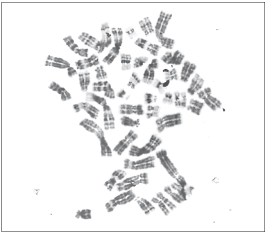

A haploid or polyploid karyotype will be evident from the chromosome  number and from the further designations, e.g., 69,XXY. All chromosome  changes should be expressed in relation to the appropriate ploidy level  (see Sections 8.1 and 9.1), e.g., 70,XXY,+21.

반수체 또는 배수체(polyploid) karyotype은 염색체 수와 추가 명시를 통해 (예: 69,XXY) 표현됩니다. 모든 염색체 변화는 적절한 배수성(ploidy) 수준(8.1절 및 9.1절 참조)으로 표현되어야 합니다(예: 70,XXY,+21).

Endoreduplication is the replication of the chromosomes without chromatid separation or cytokinesis (Fig. 7). An endoreduplicated metaphase cell is indicated by the abbreviation end preceding the karyotype designation, e.g., end 46,XX.

내중복화(endoreduplication)는 염색체 분리나 세포질 분열(cytokinesis) 없이 염색체를 복제하는 것입니다(그림 7). 내중복화 중기 세포는 karyotype 표기 앞에 약어 end를 사용하여 표시합니다(예: end 46,XX).

When it is known that a particular chromosome involved in an aberration has been inherited, the term inh may be used, e.g., 46,XX,t(5;6)(q34;q23)inh. When it is known that the  aberration is inherited from the mother or the father, the most complete information is evident by the use of the abbreviation mat or pat, respectively, immediately following the designation of the abnormality, e.g., 46,XX,t(5;6)(q34;q23)mat,inv(14)(q12q31)pat. If it is known that  the parents’ chromosomes are normal with respect to the abnormality, the abnormality may be designated de novo (dn), e.g.,  46,XY,t(5;6)(q34;q23)mat,inv(14)(q12q31)dn. When dn follows another  abbreviation, a space is inserted, e.g., 47,XY,+mar dn[14]/46,XY[16].

Aberration에 관련된 특정 염색체가 유전되었다는 사실이 알려진 경우, inh이라는 용어를 사용할 수 있습니다(예: 46,XX,t(5;6)(q34;q23)inh). Aberration이 어머니나 아버지로부터 유전되었다는 사실이 알려졌을 때, 각각 46,XX,t(5;6)(q34;q23)mat, inv(14)(q12q31)pat과 같이 mat 또는 pat이라는 용어를 사용함으로써 완전한 정보를 명백하기 표기할 수 있습니다. 부모의 염색체가 자식에서의 염색체 이상과 관련하여 정상인 것으로 알려진 경우, 그 이상은 de novo (dn)로 표기합니다(예: 46,XY,t(5;6)(q34;q23)mat, inv(14)(q12q31)dn)으로 지정될 수 있습니다. 만약 dn이 다른 용어 뒤에 위치하는 경우에는 공백을 삽입합니다(예: 47,XY,+mar dn[14]/46,XY[16]).

The same rules for designating chromosome aberrations are followed in the description of constitutional and acquired chromosome aberrations.  Terms and recommendations related to abnormalities seen in neoplasia are described in Chapter 11. When an acquired chromosome abnormality is  found in an individual with a constitutional chromosome anomaly, the  latter is indicated by the letter c immediately after the constitutional abnormality designation (see Sections 8.3 and 11.3).

선천 염색체 이상과 후천 염색체 이상은 동일한 규칙을 사용하여 표기합니다. Neoplasia에서 관찰되는 이상과 관련된 용어 및 권장사항은 11장에 설명되어 있습니다. 선천 염색체 이상이 있는 개인에서 후천 염색체 이상이 발견되면, 선천적 이상에 대한 표기는 선천적 이상을 표기한 바로 다음에 문자 c를 추가하여 표기합니다(8.3절과 11.3절 참조).

In the interest of clarity, complex rearrangements necessitating  lengthy descriptions should be written out in full the first time they  are used in a report. An abbreviated version may be used subsequently,  provided it is clearly defined immediately after the complete notation.

명확한 전달을 위해, 긴 설명이 필요한 복잡한 재배열은 보고서에 처음 언급될 때 완전한 형태(상술형; detailed system?)로 표기되어야 합니다. 축약 버전은 완전한 형태의 표기를 통해 복잡한 재배열을 명확하게 정의한 다음 사용할 수 있습니다.

Nomenclature guidelines for meiotic chromosomes are presented in Chapter 12.

감수분열 염색체에 대한 명명법 지침은 12장에 제시되어 있습니다.

## 4.2 절단점 명시 (Specification of Breakpoints)

The location of any given breakpoint is specified by the band in  which that break has occurred. Since it is not possible at present to  define band interfaces accurately, a break suspected to be at an  interface between two bands is assigned arbitrarily to the higher of the two band numbers, i.e., the number of the band more distal to the  centromere.

절단점(breakpoint)의 위치는 해당 절단이 발생한 밴드에 따라 지정됩니다. 현재 밴드 인터페이스를 정확하게 정의할 수 없기 때문에, 두 밴드 사이의 인터페이스에 있는 것으로 의심되는 절단은 두 밴드 번호 중 더 높은 밴드 번호, 즉, 중심체에서 더 먼 곳에 임의로 할당됩니다.

A given break may sometimes appear to be located in either of two  consecutive bands. A similar situation may occur when breaks at or near  an interface between two bands are studied with two or more techniques.  In this event, the break can be specified by both band numbers separated by the term or, e.g., 1q23 or q24, indicating a break in  either band 1q23 or band 1q24 (see also Section 5.3). If a break can be  localized to a region but not to a particular band, only the region  number may be specified, e.g., 1p1. Uncertainty about breakpoint  localization may also be indicated by a question mark, e.g., 1p1? (see  Section 5.1). If the breakpoint can be assigned only to two adjacent  regions, both suspected regions should be indicated, e.g., 1q2 or q3.  For the use of the approximate sign to express uncertainty, see Section  5.2. Breakpoints within the same rearrangement or karyotype string can  be at different levels of resolution reflecting the precision of the karyogram.

주어진 절단이 연속된 두 밴드 중 하나에 있는 것처럼 보일 수 있습니다. 두 개 이상의 기법을 사용하여 두 밴드 사이의 인터페이스 또는 그 근처에서의 절단에 대해 연구할 때도 유사한 상황이 발생할 수 있습니다. 이 경우, 절단은 용어 'or'로 구분된 두 가지의 밴드 번호(예: 1q23 or q24)로 표기할 수 있으며, 이는 밴드 1q23 또는 밴드 1q24의 절단을 나타냅니다(섹션 5.3 참조). 절단을 특정 영역(region)으로 한정지을 수는 있지만 특정 밴드로 한정지을 수는 없는 경우, 영역 번호(예: 1p1)만 지정할 수 있습니다. 절단점 위치 지정에 대한 불확실성은 물음표(예: 1p1?)로 표시할 수도 있습니다(섹션 5.1 참조). 절단점을 인접한 두 영역에만 할당할 수 있는 경우, 의심스러운 영역(예: 1q2 or q3)을 모두 표시해야 합니다. 불확실성을 표현하기 위해 ~ 기호를 사용하는 것은 5.2절을 참조하시기 바랍니다. 동일한 재배열(rearrangement) 또는 karyotype string 내의 중단점은 karyotype의 정밀도를 반영하는 분해능 수준에 따라 다를 수 있습니다.

When an extra copy of a rearranged chromosome is present, the  breakpoints do not need to be repeated; the breakpoints are specified only at the first time they appear in the karyotype:

재배열된 염색체의 추가 복사본이 있는 경우 절단점을 반복 표기할 필요가 없습니다. 절단점은 karyotype에 처음 나타날 때만 표기합니다 (예: 48,XX,+1,+der(1)t(1;16)(p13;q13),t(1;16)).

## 4.3 절단점과 밴드 구성에 따른 구조적 염색체 이상 표기법 ( Designating Structural Chromosome Aberrations by Breakpoints and Band Composition)

Two systems for designating structural abnormalities exist. One is a short system in which the nature of the rearrangement and the breakpoint(s) are identified by the bands or regions in which the breaks occur. Because of the conventions built into this system, the band composition of the abnormal chromosomes can readily be inferred from the information provided in the symbolic description. For very complex abnormalities, especially in tumor cells, the short system may be inadequate or ambiguous, but it will always provide information on all bands involved in the generation of an abnormal chromosome. The other is a detailed system which, besides identifying the type of rearrangement, defines each abnormal chromosome in terms of its band composition. The notation used to identify the rearrangement and the method of specifying the breakpoints are common to both systems (see Sections 4.3.1 and 4.3.2).

구조적 이상을 표기하는 두 가지 시스템이 존재합니다. 하나는 재배열과 절단점이 절단이 발생하는 밴드나 지역에 의해 식별되는 짧은 시스템입니다. 이 시스템에서 사용하는 규약 때문에, 기호를 사용한 설명(symbolic description)이 제공하는 정보로부터 이상 염색체의 밴드 구성을 쉽게 유추할 수 있습니다. 특히 종양세포와 같이 매우 복잡한 이상에 대해서는 짧은 체계가 부적절하거나 모호할 수 있지만, 이상 염색체 생성에  관여하는 모든 밴드에 대한 정보를 항상 제공합니다. 다른 하나는 상세한 시스템으로, 재배열의 유형을 확인하는 것 외에도 각각의 비정상적인 염색체를 해당 염색체를 구성하는 밴드의 관점에서 정의하는 시스템입니다. 재정렬 및 절단점 지정 방법을 식별하는 데 사용되는 표기법은 두 시스템에 대해 공통입니다(제4.3.1절 및 제4.3.2절 참조).

The genome build or assembly must be specified when designating an aberration by nucleotide position defined by microarray, region-specific assay or sequencing (see Sections 14.1, 15.1 and 16.2).

마이크로 어레이, 영역-특이적 분석 또는 시퀀싱에 의해 정의된 염기 위치에 의한 aberration을 표기할 때 게놈 빌드 또는 어셈블리를 지정해야 합니다 (제14.1절, 제15.1절 및 제16.2절 참조).

### 4.3.1 구조적 염색체 이상을 표기하는 짧은 시스템 (Short System for Designating Structural Chromosome Aberrations)

In this system, structurally altered chromosomes are defined only by their breakpoints. The breakpoints are specified within parentheses immediately following the designation of the type of rearrangement and the chromosome(s) involved. The breakpoints are identified by band designations and are listed in the same order as the chromosomes involved. No semicolon is used between breakpoints in single chromosome rearrangements.

이 시스템에서, 구조적으로 변형된 염색체들은 그들의 절단점에 의해서만 정의됩니다. 절단점은 재배열의 유형 및 재배열에 관련되어 있는 염색체(들)의 표기 바로 다음에, 괄호를 사용하여 괄호 안에 표기합니다. 절단점은 밴드 표기에 의해 식별되며 절단점과 관련된 염색체들과 동일한 순서로 나열됩니다. 단일 염색체의 재배열인 경우 절단점 사이에 세미콜론이 사용되지 않습니다.

#### 4.3.1.1 Two-Break Rearrangements

When both arms of a single chromosome are involved in a two-break rearrangement, the breakpoint in the short arm is always specified before the breakpoint in the long arm.

단일 염색체의 양쪽 팔이 two-break 재배열에 관여하는 경우, 단완의 절단점은 항상 장완의 중단점 앞에 표기됩니다.

+ 46,XX,inv(2)(p21q31)

When two breaks occur within the same arm, the breakpoint more proximal to the centromere is specified first.

동일한 팔 내에서 두 개의 절단이 발생하는 경우, 중심체에 더 가까운 중단점이 먼저 표기됩니다.

+ 46,XX,inv(2)(p13p23) 
+ 46,XX,inv(2)(q11.2q32)

When two chromosomes are involved, the chromosome having the lowest number is always listed first; however, if one of the rearranged chromosomes is a sex chromosome this is listed first.

두 개의 염색체가 관련되어 있는 경우, 가장 낮은 번호의 염색체가 항상 먼저 표기됩니다. 그러나, 만약 재배열된 염색체 중 하나가 성 염색체인 경우, 성 염색체가 먼저 나열됩니다.

+ 46,XY,t(12;16)(q13;p11.1) 
+ 46,X,t(X;18)(p11.1;q11.1)

#### 4.3.1.2 Three-Break Rearrangements

An exception to the rule that sex chromosomes and autosomes with the lowest number are specified first involves three-break rearrangements in which part of one chromosome is inserted into another chromosome. In that event, the donor chromosome is listed last, even if it is a sex chromosome or an autosome with a lower number than that of the receptor chromosome.

한 염색체의 일부가 다른 염색체에 삽입되는 three-break 재배열은 성염색체와 가장 낮은 번호의 상염색체가 먼저 표기된다는 규칙의 예외에 해당합니다. 이 경우 공여 염색체는 성 염색체이거나 수용체 염색체보다 번호가 낮은 상염색체라 하더라도 가장 마지막에 표기됩니다.

+ 46,X,ins(5;X)(p14;q21q25) 
+ 46,XY,ins(5;2)(p14;q22q32)

When an insertion within a single chromosome occurs, the breakpoint at which the chromosome segment is inserted is always specified first. The remaining breakpoints are specified in the same way as in a two-break rearrangement, i.e., the more proximal breakpoint of the inserted segment is specified first and the more distal one last if the insertion is direct and vice versa if it is inverted.

단일 염색체 내에 삽입이 발생하면 염색체 세그먼트가 삽입되는 절단점이 항상 먼저 표기됩니다. 나머지 절단점은 two-break 재배열에서와 같은 방식으로 표기됩니다. 즉, 삽입된 세그먼트의 근위부 절단점이 먼저 표기되고 원위부 절단점이 마지막으로 지정되나, inversion된 삽입의 경우에는 반대가 됩니다.

+ 46,XX,ins(2)(q13p13p23)

Direct insertion of the short-arm segment between bands 2p13 and 2p23 into the long arm at band 2q13.

밴드 2p13과 2p23 사이의 단완 세그먼트가 장완의 밴드 2q13에 삽입됩니다.

+ 46,XX,ins(2)(q13p23p13)

Inverted insertion of the short-arm segment between bands 2p13 and 2p23 into the long arm at band 2q13. Because the insertion is inverted, band 2p23 is now proximal and band 2p13 distal to the centromere.

밴드 2p13과 2p23 사이의 단완 세그먼트를 장완의 밴드 2q13에 거꾸로 삽입합니다. 거꾸로 삽입되었기 때문에 밴드 2p23은 이제  중심체에 대해 근위부이고 밴드 2p13은 원위부가 됩니다.

For translocations involving three chromosomes, with one breakpoint in each, the rule is still followed that the sex chromosome or autosome with the lowest number is given first. The chromosome listed next is the one that receives a segment from the first chromosome, and the chromosome specified last is the one that donates a segment to the first chromosome listed.

각각 1개의 절단점이 있는 3개의 염색체가 관여하는 전위의 경우, 여전히 성 염색체나 가장 낮은 번호의 상염색체를 먼저 표기하는 규칙을 따릅니다. 그 다음에 표기되는 염색체는 첫 번째 염색체에서 한 부분을 받는 염색체이고, 마지막으로 표기되는 염색체는 한 부분을 첫 번째 염색체에 주는 염색체입니다.

46,XX,t(9;22;17)(q34;q11.2;q22)

The segment of chromosome 9 distal to 9q34 has been translocated onto chromosome 22 at band 22q11.2, the segment of chromosome 22 distal to 22q11.2 has been translocated onto chromosome 17 at 17q22, and the segment of chromosome 17 distal to 17q22 has been translocated onto chromosome 9 at 9q34.

9번 염색체 말단~9q34의 세그먼트가 22번 염색체의 22q11.2 밴드로 전위되고, 22번 염색체 말단~22q11.2의 세그먼트는 17번 염색체의 17q22 밴드로 전위되며, 17번 염색체 말단~17q22의 세그먼트가 9번 염색체의 9q34 밴드로 전위되었습니다.

46,Y,t(X;15;18)(p11.1;p11.1;q11.1)

X염색체 말단~Xp11.1의 세그먼트가 15번 염색체의 15p11.1 밴드로 전위되고, 15번 염색체의 말단~15p11.1의 세그먼트는 18번 염색체의 18q11.1 밴드로 전위되며, 18번 염색체 말단~18q11.1의 세그먼트가 X염색체의 Xp11.1밴드로 전위되었습니다.

#### 4.3.1.3 4-break 이상의 복잡한 재배열

가능한 경우, 3-break 재배열 대한 지침을 사용해야 합니다.

+ 46,XX,t(3;9;22;21)(p13;q34;q11.2;q21)

3번 염색체 말단~p13 세그먼트는 9번염색체 q34밴드로 전위되고, 9번 염색체 말단~q34 세그먼트는 22번 염색체 q11.2 밴드로 전위되고, 22번 염색체 말단~q11.2 세그먼트는 21번 염색체 q21 밴드로 전위되고, 21번 염색체 말단~q21 세그먼트는 3번 염색체 p13 밴드로 전위되었습니다.

+ 46,XY,t(5;6)(q13q23;q15q23)

Reciprocal translocation of two interstitial segments. The segments between bands 5q13 and 5q23 of chromosome 5 and between 6q15 and 6q23 of chromosome 6 have been exchanged.

두 interstitial segment의 상호 전좌입니다. 5번 염색체의 5q13과 5q23번 밴드 사이의 세그먼트와 6번 염색체의 6q15와 6q23 사이의 부분들이 교환되었습니다.

Unbalanced rearrangements will lead to at least one derivative chromosome and in these situations the use of the symbol der to describe the derivative chromosome(s) is recommended (see Section 9.2.3). It will usually not be possible to adequately describe all complex rearrangements with the short system. The detailed system can always be used to describe any abnormality, however complex. Still, it may be necessary to illustrate the rearrangement and/or describe it in words to ensure complete clarity.

불균등 재배열로 인해 적어도 하나의 파생(derivative) 염색체가 발생할 수 있으며, 이러한 상황에서는 파생 염색체를 설명하는 기호인 der를 사용할 것을 권장합니다(9.2.3절 참조). 일반적으로 짧은 시스템으로는 모든 복잡한 재배열을 적절하게 설명할 수 없습니다. 상술형(detailed) 시스템은 아무리 복잡한 모든 이상도 항상 설명할 수 있습니다. 그러나 명확성을 확실히 보장하기 위해 재배열을 그림으로 표현하거나 단어로 설명해야 할 수도 있습니다.

### 4.3.2 구조적 염색체 이상을 표기하는 상술형 시스템 (Detailed System for Designating Structural Chromosome Aberrations)

Structurally altered chromosomes are defined by their band composition. The conventions used in the short system are retained in the detailed system, except that an abbreviated description of the band composition of the rearranged chromosome(s) is specified within the last parentheses, instead of only the breakpoints. It is acceptable to combine the short system (4.3.1) and the detailed system for designating complex karyotypes, especially to describe acquired chromosomal abnormalities.

구조적으로 변형된 염색체들은 그들의 밴드 구성에 의해 정의됩니다. 짧은 시스템에 사용되는 규약은 상술형 시스템에서도 유지됩니다. 짧은 시스템에서 절단점만을 표기하는 대신, 마지막 괄호 내에 재배열된 염색체의 밴드 구성에 대한 축약된 설명을 표기한 것은 이에 대한 예외로서 상술형에서는 적용되지 않습니다. 복잡한 karyotype 표기를 위해-특히 후천성 염색체 이상을 기술하기 위해-, 짧은 시스템(4.3.1절)과 상술형 시스템을 결합하여 사용하는 것이 허용됩니다.

> 그림8. 표 4에 제시된 disjunctional 가능성과 파생 염색체 조합을 명시하는 데 사용되는 t(2;5)(q21;q31) 상호 변환  heterogyzote의 태사기(pachytene; 굵은 섬유기) 다이어그램입니다. 문자 A, B, C, D는 염색체 끝(텔로미어)을 표시합니다. 단순성을 위해 교차(crossing-over)에 관련된 4가지 크로마티드 중 2개만 표시됩니다(표 4 참조). X표는 교차 위치를 표시합니다.
> 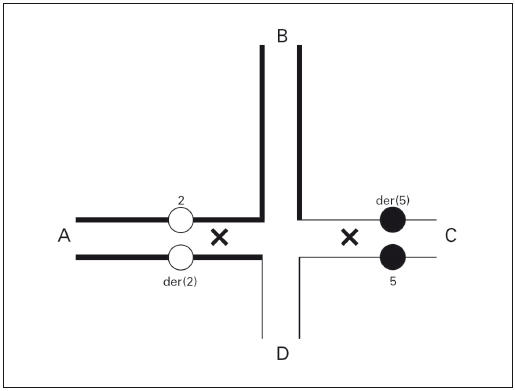 

#### 4.3.2.1 추가 기호 (Additional Symbols)

A single colon (:) is used to indicate a chromosome break and a double colon (::) to indicate break and reunion. In order to avoid an unwieldy description, an arrow (→ or ->), meaning from – to, is employed. The end of a chromosome arm may be designated either by its band designation or by the symbol ter (terminal), preceded by the arm designation, i.e., pter indicates the end of the short arm and qter the end of the long arm. When it is necessary to indicate the centromere, the abbreviation cen should be used.

단일 콜론(:)은 염색체 절단을 나타내기 위해, 이중 콜론(::)은 절단과 재결합(reunion)을 나타내기 위해 사용됩니다. 이해하기 어려운 설명을 피하기 위해 ~에서 ~까지라는 의미의 화살표(→ 또는 ->)를 사용합니다. 염색체 팔의 끝은 밴드 명칭 또는 용어 ter (terminal)을 사용하여 표기할 수 있으며, 예를 들어, pter는 단완의 끝, qter은 장완의 끝을 나타냅니다. 중심체를 표기해야 할 경우 용어 cen을 사용해야 합니다.

#### 4.3.2.2 염색체의 밴드 구성에 대한 표기 (Designating the Band Composition of a Chromosome)

The description starts at the end of the short arm and proceeds to the end of the long arm, with the bands being identified in the order in which they occur in the rearranged chromosome. If the rearrangement is confined to a single chromosome, the chromosome number is not repeated in the band description. If more than one chromosome is involved, however, the bands and chromatid ends are identified with the appropriate chromosome numbers. The aberrations should be listed according to the breakpoints of the derivative chromosome from pter to qter and should not be separated by a comma.

표기는 단완 끝에서 시작하여 장완 끝까지 진행되며, 밴드는 재배열된 염색체에서 발생하는 순서대로 식별됩니다. 재배열이 단일 염색체 내에서만 일어난 경우, 염색체 번호는 밴드 표기에 반복적으로 표기하지 않습니다. 그러나 둘 이상의 염색체가 관련된 경우, 적절한 염색체 번호를 사용하여 밴드와 염색체 말단을 표기합니다. 염색체 이상은 파생 염색체의 절단점에 따라 pter에서 qter 방향으로 나열되어야 하며 쉼표로  구분되어서는 안 됩니다.

If, owing to a rearrangement, no short-arm segment is present at the end of either arm, the description of the structurally rearranged chromosome starts at the end of the long-arm segment with the lowest chromosome number. However, if a portion of the proximal short arm is present, the description begins with the material on the end of that chromosome arm even if the recipient segment is from a long arm or from a chromosome with a higher or lower chromosome number. For use of the detailed system, see examples in Section 9.2.3.

재배열로 인해 양쪽 팔의 끝에 단완 세그먼트가 없는 경우 구조적으로 재배열된 염색체의 표기는 가장 낮은 염색체 번호, 장완의 끝에서 시작됩니다. 그러나 근위부에 단완의 일부가 존재하는 경우, 수여자 세그먼트가 장완에서 나오거나, 염색체 번호가 더 높거나, 더 낮더라도 해당 염색체 팔의 끝에 있는 물질(염색질)에서 표기가 시작됩니다. 상술형 시스템의 사용은 9.2.3절의 예를 참조합니다.

> 표4. 산모 기원의 균형 상호 전좌의 segregation(분리)에 의해 파생될 수 있는 불균형 생식세포(접합자, gametes)들입니다. 태사기(pachytene) 구성은 그림 8에 나와 있습니다. (Possible unbalanced gametes derived from segregation of a balanced reciprocal translocation of maternal origin. The pachytene configuration is given in Fig. 8.)
>
> 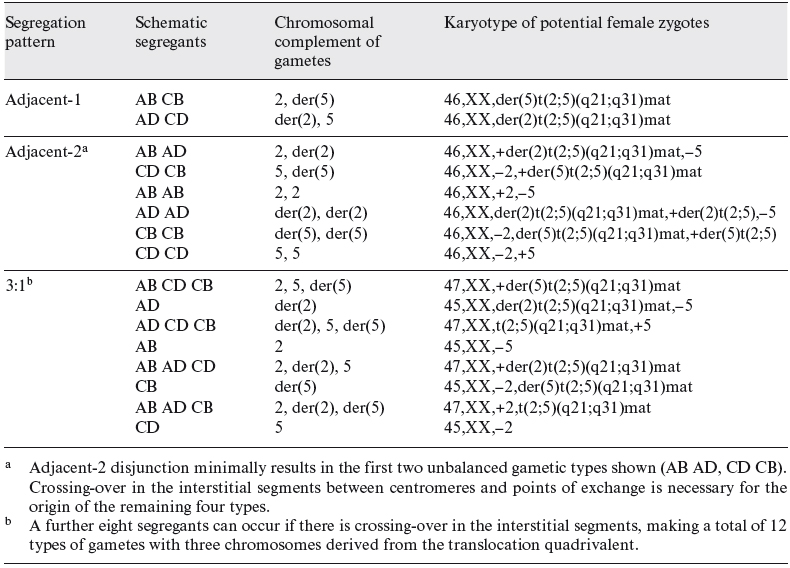

## 4.4 파생 염색체 (Derivative Chromosomes)

A derivative chromosome is a structurally rearranged chromosome generated by (1) more than one rearrangement within a single chromosome, e.g., an inversion and a deletion of the same chromosome, or deletions in both arms of a single chromosome, or (2) rearrangements involving two or more chromosomes, e.g., the unbalanced product(s) of a translocation. An abnormal chromosome in which no part can be identified is referred to as a marker chromosome (see Section 9.2.12).

파생 염색체는 (1) 단일 염색체 내에서 둘 이상의 재배열(예: 동일한 염색체의 역위 및 결실, 또는 단일 염색체의 양쪽 팔의 결실)로 또는 (2) 둘 이상의 염색체 재배열(예: 전좌에 따라 발생하는 불균형 산물)로 생성되는 구조적으로 재배열된 염색체입니다.  어떤 부분도 식별할 수 없는 비정상 염색체를 마커(marker) 염색체라고 합니다(9.2.12절 참조).

Derivative chromosomes are designated der. The term always refers to the chromosome(s) that has an intact centromere or neocentromere (Section 9.2.13). The derivative chromosome is specified in parentheses, followed by all aberrations involved in the generation of the derivative chromosome. The aberrations should be listed according to the breakpoints of the derivative chromosome from pter to qter and should not be separated by a comma. For example, der(1)t(1;3)(p32;q21)t(1;11)(q25;q13) specifies a derivative chromosome 1 generated by two translocations, one involving the short arm with a breakpoint in 1p32 and the other involving the long arm with a breakpoint in 1q25.

파생 염색체는 der로 표기됩니다. 이 용어는 항상 온전한 중심체 또는 신중심체(Neocentromere)를 가진 염색체를  가리킵니다 (9.2.13절). 파생 염색체는 괄호 안에 명시되며, 파생 염색체 생성에 관련된 모든 이상 현상이 그 뒤에 뒤따릅니다.  염색체 이상은 파생 염색체의 절단점에 따라 pter에서 qter 방향으로 나열되어야 하며 쉼표로 구분되어서는 안 됩니다. 예를 들어,  der(1)t(1;3)(p32;q21)t(1;11)(q25;q13)는 두 개의 전좌에 의해 파생되어 생성된 1번 염색체를 의미합니다. 두 전좌 중 하나는 1p32에 절단점이 있는 단완을 포함하고 다른 하나는 1q25에 중단점이 있는 장완을 포함합니다.

> 그림9. Fig. 9. Diagram of an inv(2)(p21q31)mat pericentric inversion heterozygote. Bands delimiting the breakpoints (arrows on original) are shown as black boxes on the short arm and as hatched boxes on the long arm. In the pachytene diagram, the cross indicates crossing-over within the inversion loop. For the sake of simplicity only those two of the four chromatids that are involved in crossing-over and give rise to the recombinant chromosomes are indicated.
>
> inv(2)(q21q31)mat의 pericentric 역위 이형접합에 대한 다이어그램입니다. 절단점을 구분하는 밴드 (original의 화살표)는 단완에서는 검은색 상자로, 장완에서는 빗금 상자로 표시됩니다. 태사기 다이어그램에서 X는 inversion loop 내의 교차(crossing-over)를 나타냅니다. 단순성을 위해 4개의 염색체 중 교차에 관여되어 재조합 염색체를 생성하는 두 염색체만 표시하였습니다.
>
> 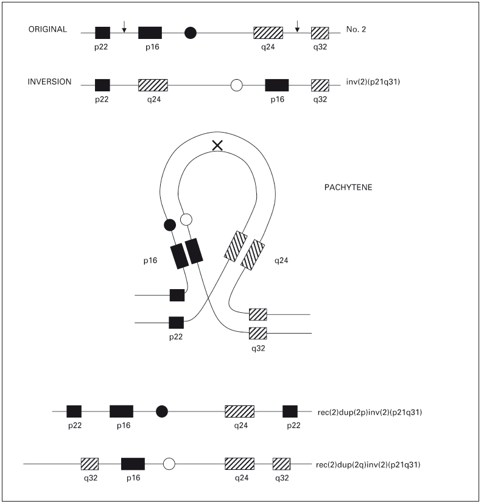

Various derivative chromosomes and their designations are presented in Section 9.2.3. As an illustration of the way derivative chromosomes can be written, a balanced reciprocal translocation between chromosomes 2 and 5, 46,XX,t(2;5)(q21;q31), has been assumed and is represented by the pachytene diagram in Fig. 8. The derivative chromosomes from such a translocation would be designated der(2) and der(5). Table 4 gives the possible unbalanced gametes resulting from adjacent-1 and adjacent-2 disjunctions and also from four of the 12 possible 3:1 disjunctions, together with the recommended designations of the karyotypes resulting from syngamy between each unbalanced gametic type and a normal gamete. The full karyotype designation needs be written only once in any given publication and then can be abbreviated. A suggested abbreviation for the first designated karyotype in Table 4, for example, would be 46,XX,der(5)mat.

다양한 파생 염색체 및 그 표기는 9.2.3절에 제시되어 있습니다. 파생 염색체가 발생할 수 있는 방법의 예로서, 2, 5번염색체, 46,XX,t(2;5) (q21;q31) 사이의 균형 상호 전좌가 가정되었고 이는 그림 8의 태사기 다이어그램으로 표현됩니다. 이러한 전좌에서 파생 염색체는 der(2)와 der(5)로 표기될 것입니다. 표 4는 adjacent-1과 adjacent-2의 분리에 의해 나타날 수 있는 불균형 생식세포와 12개의 가능한 3:1 disjunction 중 4개에 의해 나타날 수 있는 불균형 생식세포를 나타냈으며, 또한 각 불균형 생식세포 유형과 일반 생식세포 사이의 배우자 합체(syngamy)에 따라 나타나는 karyotype의 권장 표기도 함께 제공합니다. 전체 karyotype 표기는 특정 출판에서 한  번만 작성하면 되며, 그 다음부터는 축약할 수 있습니다. 예를 들어 표 4에 표기된 첫 번째 karyotype의 약어는  46,XX,der(5)mat입니다. -->> 무슨 말이지..?

## 4.5 재조합 염색체 (Recombinant Chromosomes)

A recombinant chromosome is a structurally rearranged chromosome with a new segmental composition resulting from meiotic crossing-over between a displaced segment and its normally located counterpart in certain types of structural heterozygotes.

재조합 염색체는 구조적으로 재배열된 염색체이며, 특정 종류의 구조적 이형접합자에서, 감수분열 과정 중, displaced segment와 정상 counterpart 사이에 발생하는 교차(crossing-over)로 인해 유래되는 새로운 세그먼트 구성을 가지고 있습니다.

Whereas derivative chromosomes are products of the original rearrangement and segregate at meiosis without further change, recombinant chromosomes arise de novo during gametogenesis in appropriate structural heterozygotes as predictable consequences of crossing-over in a displaced segment.

파생 염색체들은 원래의 재배열과 segregate로부터 감수분열 중 더 이상의 변화 없이 나타나는 산물인 반면, 재조합 염색체들은 생식세포 발생 동안 displaced 세그먼트의 교차에 따라 예측되는 적절한 구조적 이형접합의 결과로서 de novo로 발생하는 것입니다. 

Recombinant chromosomes are designated by the symbol rec. The recombinant chromosome is specified in parentheses immediately following the symbol. The chromosome designation used is that which indicates the origin of the centromere of the particular recombinant chromosome.

재조합 염색체는 기호 rec를 사용하여 표기합니다. 재조합 염색체는 기호 바로 뒤에 위치한 괄호 안에 표기합니다. 염색체 표기는 특정 재조합 염색체에서 중심체의 기원(origin)을 표기합니다.

# 5 불확실한 염색체 혹은 밴드 표기법

## 5.1 식별이 불확실한 경우 (Questionable Identification)

A question mark (?) indicates questionable identification of a chromosome or chromosome structure. It is placed either before the uncertain item, or it may replace a chromosome, region, or band designation (see also examples in Section 9.2.3).

물음표(?)는 염색체나 염색체 구조의 식별이 의심스럽다는 것을 나타냅니다. 물음표(?)를 불확실한 항목 앞에 배치하거나 염색체, 영역 또는 밴드 명칭을 대체하여 사용할 수 있습니다(9.2.3절의 예제 참조).

45,XX,-?21

A missing chromosome, probably No. 21.

없어진 염색체는 아마도 21번 염색체입니다.

47,XX,+?8

An additional chromosome, probably No. 8.

추가 염색체는 아마 8번일 것입니다.

46,XX,del(1)(q2?)

The break in the long arm of chromosome 1 is in region 1q2, but it has not been possible to determine the band within that region.

1번 염색체의 장완의 절단은 1q2 지역에 있지만, 그 지역 내의 밴드를 판별하는 것은 불가능합니다.

46,XY,del(1)(q2?3)

The break in the long arm of chromosome 1 is in region 1q2, probably in band 1q23, but this is uncertain.

1번 염색체의 장완의 절단은 1q2 지역, 아마도 1q23 밴드에 있을 것입니다. 하지만 이것은 불확실합니다.

46,XX,del(1)(q?2)

The break is in the long arm of chromosome 1, probably in region 1q2.

절단은 1번 염색체의 장완, 아마도 1q2 지역에 있을 것입니다.

46,XY,del(1)(q?23)

It is uncertain whether the break in the long arm of chromosome 1 is in region 1q2. If so, the break is in band 1q23.

1번 염색체의 장완의 절단이 1q2 지역에 있는 것인지는 불확실하나, 만약 그렇다면, 절단은 밴드 1q23에 있습니다.

46,XX,del(1)(q?)

The break is in the long arm of chromosome 1, but neither the region nor the band can be identified. This aberration is often described as 1q-, a notation that may be useful in text but should not be used in karyotype nomenclature.

절단은 1번 염색체의 긴 팔 부분에 있지만, 부위도 밴드도 구분할 수 없습니다. 이러한 이상은 1q-로 표기되기도 하는데, 이와 같은 표기는 텍스트에서는 유용할 수 있지만 카리오타입 명명법에서는 사용해서는 안 됩니다.

46,XY,?del(1)(q23)

A possible deletion in chromosome 1, band 1q23, but all items, including the deletion, are uncertain.

1번 염색체, 밴드 1q23에서 deletion이 존재할 수 있으나 deletion을 포함한 모든 항목이 불확실합니다.

46,XX,der(1)?t(1;3)(p22;q13)

The der(1) has probably resulted from a t(1;3). If so, the breaks are in bands 1p22 and 3q13.

der(1)은 t(1;3)의 결과일 수 있습니다. 만약 그렇다면, 절단점은 1p22와 3q13 밴드에 있습니다.

## 5.2 염색체 번호 또는 절단점 위치가 불확실한 경우 (Uncertain Breakpoint Localization or Chromosome Number)

An approximate sign (~) is used to denote intervals and to express uncertainty about breakpoint localizations in that it indicates the boundaries of a chromosome segment in which the breaks may have occurred.

물결 기호(~)는 절단이 발생했을 수 있는 염색체 부분의 경계를 표시한다는 점에서 구간(interval)을 나타내며, 절단점 위치에 대한 불확실성을 표현하는 데 사용됩니다.

46,XX,del(1)(q21~24)

A terminal deletion of the long arm of chromosome 1 with a breakpoint within the segment 1q21–q24, i.e., the breakpoint may be in band 1q21, 1q22, 1q23 or 1q24.

세그먼트 1q21–q24 내에 중단점이 있는 염색체 1의 장암에 대한 말단 부분의 결실, 즉 중단점은 밴드 1q21, 1q22, 1q23 또는 1q24일 수 있습니다.

46,XY,dup(1)(q22~24q44)

A duplication in the long arm of chromosome 1; the proximal breakpoint is in band 1q22, 1q23 or 1q24.

1번 염색체의 장암에서 중복이 존재하며, 근위부 중단점은 1q22, 1q23 또는 1q24 밴드일 수 있습니다.

46,XX,t(3;12)(q27~29;q13~15)

Both breakpoints in this translocation are uncertain; in chromosome 3 the breakpoint may be in bands 3q27, 3q28 or 3q29 and in chromosome 12 in bands 12q13, 12q14 or 12q15.

이 전좌에서 두 절단점 모두가 불확실합니다. 3번 염색체에서 절단점은 3q27, 3q28, 3q29 밴드일 수 있으며, 12번 염색체에서 절단점은 12q13, 12q14 또는 12q15 밴드일 수 있습니다.

43~47,XX,…

The chromosome number is within the interval 43–47.

염색체 개수는 43-47 사이에 있습니다.

## 5.3 여러 해석이 존재하는 경우 (Alternative Interpretation)

The symbol or is used to indicate alternative interpretations of an aberration. Note that there should be a space before and after the symbol.

or 기호는 이상(aberration)의 다른 해석을 나타내는 데 사용됩니다. 기호 앞뒤에 공백이 있어야 합니다.

46,XX,add(19)(p13 or q13)

Additional material of unknown origin attached to either 19p13 or 19q13 (see Section 9.2.1).

출처를 알 수 없는 재료(염색질)가 19p13 또는 19q13에 추가됩니다 (9.2.1절 참조).

46,XY,del(8)(q21.1) or i(8)(p10)

A deletion of the long arm of a chromosome 8 with a breakpoint in 8q21.1 or an isochromosome for the short arm of chromosome 8.

8q21.1에 절단점이 있는 8번 염색체의 장암의 결실 혹은 8번 염색체의 단암에 대한 isochromosome일 수 있습니다.

46,XX,t(12;14)(q15;q24) or t(12;14)(q13;q22)

The two alternative interpretations of the t(12;14) give rise to identical-looking derivative chromosomes. This is in principle a different situation than t(12;14)(q13~15;q22~24), which means that the breakpoint localizations in the t(12;14) are less certain and a variety of combinations are possible.

t(12;14)에 대한 두 가지 해석은 동일한 모양의 파생(이상한) 염색체를 생성합니다. 이는 원칙적으로 t(12;14)(q13~15;q22~24)와는 다른 상황이며, 이는 t(12;14)의 절단점 위치가 덜 확실하고 다양한 조합이 가능하다는 것을 의미합니다.

46,XY,der(1)t(1;10)(q44;q22) or dup(1)(q32q44)

A rearranged chromosome 1 that may have originated either from a translocation to 1q44 of the distal segment of the long arm of chromosome 10 with a breakpoint in 10q22, or from a duplication of the segment from 1q32 to 1q44.

재배열된 1번 염색체는 1q44, 10q22의 전좌로 인해 발생하였거나 1q32부터 1q44까지의 세그먼트가 중복되어 발생하였을 수 있습니다.

## 5.4 불완전 핵형 (Incomplete Karyotype)

The symbol inc denotes that the karyotype presented is incomplete, usually because of poor chromosome quality. The karyotype is thus likely to contain unidentified structural or numerical changes in addition to the abnormalities listed. The symbol inc is placed at the end of the nomenclature string, after the description of identifiable abnormalities.

inc 기호는 일반적으로 염색체의 질이 나빠서 제시된 카리오타입이 불완전하다는 것을 나타냅니다. 따라서 카리오타입에는 나열된 이상과 더불어 확인되지 않은 구조 또는 수치 변화가 포함될 가능성이 있습니다. 기호 inc는 식별 가능한 이상에 대한 설명 뒤에 명명 문자열 끝에 배치됩니다.

46,XX,del(1)(q21),inc[4]

It has only been possible to identify a clonally occurring deletion of the long arm of chromosome 1, but analysis is incomplete. Without the symbol inc, the del(1)(q21) would be the sole anomaly present in this tumor.

1번 염색체의 장암에서 클론성으로 발생하는 삭제를 식별하는 것은 가능했지만, 핵형 분석은 완료할 수 없었습니다. 기호 inc가 없으면 del(1)(q21)이 이 종양에 유일한 이상 징후가 됩니다.

53~57,XY,+1,+3,+6,t(9;22)(q34;q11.2),+21,+3mar,inc[cp10]

This abnormal karyotype has, in addition to the abnormalities presented that include three marker chromosomes, other changes that could not be identified. cp indicates a composite karyotype from 10 cells (see Section 11.1.5).

**이 비정상적인 카리오타입은 3개의 마커 염색체를 포함하는 제시된 이상과 더불어, 식별할 수 없는 다른 이상을 가지고 있습니다. cp는 10개의 세포에서 composite karyotype을 나타냅니다(섹션 11.1.5 참조).** (이해 필요함)

Every attempt should be made to present karyotypes in which each abnormality has been identified. The use of inc should be restricted to exceptional situations.

각 이상이 확인된 카리오타입을 표시하기 위한 모든 종류의 시도를 해야합니다. inc의 사용은 예외적인 상황으로 제한되어야 합니다.

# 6 핵형에서 염색체 이상을 표기하는 순서 (Order of Chromosome Abnormalities in the Karyotype)

Sex chromosome aberrations are specified first (X chromosome abnormalities are presented before those involving Y), followed by abnormalities of the autosomes listed in numerical order irrespective of aberration type. For each chromosome, numerical abnormalities are listed before structural changes. Multiple structural changes of homologous chromosomes are presented in alphabetical order according to the abbreviated term of the abnormality. For order of clone presentation, see Sections 4.1, 11.1.4 and 11.1.6.

성염색체 이상이 먼저 표기되고(X염색체 이상은 Y와 관련된 염색체보다 먼저 표시), 그 다음으로 이상유형에 관계없이 염색체 번호 순으로 나열되는 상염색체 이상이 뒤따릅니다. 각 염색체마다 구조적 변화 이전에 수적 이상이 나열됩니다. 상동 염색체의 다중 구조 변화는 이상을 표기하는 약어의 알파벳 순으로 표기합니다. 클론 프리젠테이션 순서는 4.1절, 11.1.4절 및 11.1.6절을 참조하세요.

50,X,+X,–Y,+10,+14,+17,+21[5]/46,XY[15]

The numerical abnormality of the X is listed before that of the Y.

X의 수적 이상은 Y의 수적 이상보다 먼저 표기됩니다.

47,X,t(X;13)(q27;q12),inv(10)(p13q22),+21

성염색체 이상이 먼저 제시되고, 그 뒤에 이상이 수적인지 구조적인지에 관계없이 염색체 번호 순서로 상염색체 이상이 표기됩니다.

47,Y,t(X;13)(q27;q12),inv(10)(p13q22),+21

The same karyotype as in the previous example in a male.

이전 예에서와 동일한 카리오타입이나, 남성입니다.

46,t(X;18)(p11.1;q11.2),t(Y;1)(q11.2;p13)

X염색체와 관련된 이상은 Y염색체 앞에 나열되어 있습니다.

48,X,t(Y;12)(q11.2;p12),del(6)(q11),+8,t(9;22)(q34;q11.2),+17,–21,+22

The translocation involving the Y chromosome is presented first, followed by all autosomal abnormalities in strict chromosome number order.

Y염색체와 관련된 전좌가 먼저 제시되고, (엄격하게) 염색체 번호 순으로 모든 상염색체 이상이 표기됩니다.

49,X,inv(X)(p21q26),+3,inv(3)(q21q26.2),+7,+10,–20,del(20)(q11.2),+21

The inversion of the X chromosome is listed first. The extra chromosome 3 is presented before the inversion of chromosome 3 and the monosomy 20 before the deletion of chromosome 20. Note that the karyotype can also be written as:
49,X,inv(X)(p21q26),+inv(3)(q21q26.2),+7,+10,–20,del(20)(q11.2),+21
and is preferred as it gives the shortest karyotype string.

X 염색체의 역위가 먼저 나열됩니다. 여분의 3번 염색체는 3번 염색체의 역위를 표기하기 전에 표기하며, 20번 염색체의 결실을 표기하기 전에 20번 염색체의 monosomy를 표기합니다. Karyotype은 다음과 같이 기록될 수도 있습니다.
49,X,inv(X)(p21q26),+inv(3)(q21q26.2),+7,+10,–20,del(20)(q11.2),+21
이는 karyotype 문자열의 길이가 가장 짧기 때문에 선호됩니다.

50,XX,+1,+del(1)(p13),+dup(1)(q21q32),+inv(1)(p31q41),+8,r(10)(p12q25),–21

There are four abnormalities involving different copies of chromosome 1. The numerical change is presented first, followed by the structural aberrations listed in alphabetical order: del, dup, inv.

**1번 염색체의 서로 다른 카피와 관련된 네 가지 이상이 있는 경우입니다. 먼저 수적 이상이 표기되고, 그 다음 알파벳 순서로 나열된 구조적 이상(del, dup, inv)이 표기됩니다.** 이해 필요(그래서 1번 염색체는 최종적으로 4개인거?)

46,XX,der(8)ins(8;?)(p23;?)del(8)(q22)

There are two abnormalities involving one chromosome 8. The chromosome 8 is described as a derivative with the structural aberrations listed from the distal p arm to the distal q arm, rather than in alphabetical order, because the insertion and deletion are present on the same derivative chromosome.

8번 염색체 한 개와 관련된 두 가지 이상이 있습니다. 8번 염색체는 원위 p 암에서 원위 q 암까지의 구조적 이상과 함께 파생된 것으로 설명되는데, 이는 삽입과 삭제가 동일한 파생 염색체에 존재하기 때문입니다.

Unidentified ring chromosomes (r), marker chromosomes (mar), and double minute chromosomes (dmin) are listed last, in that order.

식별되지 않은 링 염색체(r), 마커 염색체(mar) 및 이중미세염색체(dmin)가 마지막으로 나열됩니다.

52,XX,…,+r,+mar,12~20dmin

Derivative chromosomes whose centromere is unknown (see Section 9.2.3) should be placed after all identified abnormalities but before unidentified ring chromosomes, marker chromosomes, and double minute chromosomes.

중심체를 알 수 없는 파생 염색체(9.2.3절 참조)는 모든 식별된 이상을 표기한 후 표기되어야 하나, 단, 미확인 링 염색체, 마커 염색체 및 이중미세염색체 앞에 표기해야 합니다.

52,XX,…,+der(?)t(?;6)(?;q16),+r,+mar,5~9dmin

# 7 염색체의 정상 변이 특성 (Normal Variable Chromosome Features)

## 7.1 이질염색성 세그먼트, 부수체 경상부, 부수체의 변이 (Variation in Heterochromatic Segments, Satellite Stalks, and Satellites)

Variation refers to the differences in size or staining of chromosomal segments in the population (see Wyandt and Tonk, 2008).

Variation은 인구집단(모집단)에서 염색체 세그먼트의 크기 또는 염색의 차이를 의미합니다 (Wyandt 및 Tonk, 2008 참조).

### 7.1.1 길이의 변동 (Variation in Length)

Variation in length of heterochromatic segments (h), stalks (stk) or satellites (s) should be distinguished from increases or decreases in arm length as a result of other structural alterations by placing a plus (+) or minus (–) sign after the symbols h, stk or s following the appropriate chromosome and arm designation.

이질염색성 세그먼트(h), 줄기(경상부; stk) 또는 부수체(s)의 길이 변동은 적절한 염색체 및 암 명칭 다음에 기호 h, stk 또는 s 를 추가한 다음, 더하기(+) 또는 빼기(–) 기호를 배치하여 다른 구조 변경으로 인한 암 길이의 증가 또는 감소와 구별합니다.

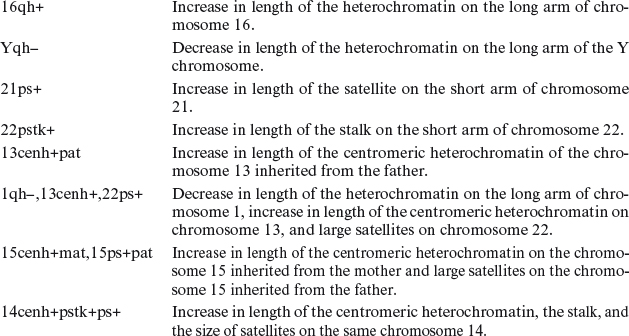

### 7.1.2 수, 위치의 변동 (Variation in Number and Position)

The same nomenclature symbols as described above are used to describe variation in position of heterochromatic segments, satellite stalks, and satellites.

위에서 설명한 것과 동일한 명명 기호가 이질염색성 세그먼트, 줄기 또는 부수체의 위치 변동을 설명하는 데 사용됩니다.

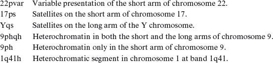

Duplicated chromosome structures are indicated by repeating the appropriate designation:

중복된 염색체 구조는 적절한 표기를 반복하여 나타냅니다.

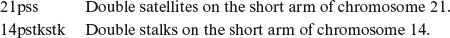

In contrast, the common population inversion variants (see Table 1) are specified by their euchromatic breakpoints.

이와는 대조적으로 일반 모집단의 역위 변이(표 1 참조)는 해당 euchromatic 절단점에 의해 지정됩니다.

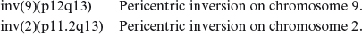

## 7.2 취약 부위 (Fragile Sites)

(위키피디아: 염색체 취약 부위는 염색체의 특정 유전적 지점으로, gap이나 constriction이 일어나는 경향이 있으며, 세포가 부분 복제 스트레스에 노출될 때 절단되는 경향이 있습니다.)

Fragile sites (fra) associated with a specific disease or phenotype are referred to in Section 9.2.7.

특정 질병 또는 표현형과 관련된 취약한 부위(fra)는 9.2.7절에 언급되어 있습니다.

Fragile sites associated with specific chromosome bands can occur as normal variants with no phenotypic consequences. These fragile sites are inherited in a co-dominant Mendelian fashion and may result in chromosome abnormalities such as deletions, multiradial figures, and acentric fragments. While there may be several different types of fragile sites inducible by culturing cells in media containing different components, all these will be covered by a single nomenclature.

특정 염색체 밴드와 연관된 취약 부위는 표현형에 변화가 없는 정상 변이형으로 발생할 수 있습니다. 이러한 취약 부위는 공동우성 멘델 유전 방식으로 유전되며, 결실, multiradial figures, 중심체가 없는 조각과 같은 염색체 이상을 초래할 수 있습니다. 서로 다른 구성 요소를 포함하는 배지에서 세포를 배양하여 유도할 수 있는 여러 가지 다른 유형의 취약 부위가 있을 수 있지만, 이 모든 것은 단일 명명법에 의해 명명될 것입니다.

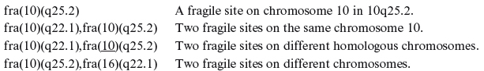

+ fra(10)(q25.2)
+ fra(10)(q22.1),fra(10)(q25.2)
+ fra(10)(q22.1),fra(<u>10</u>)(q25.2)
+ fra(10)(q25.2),fra(16)(q22.1)

# 8 수적 염색체 이상 (Numerical Chromosome Abnormalities)

## 8.1 일반 원칙

A plus (+) or minus (–) sign is placed before a chromosome to indicate gain or loss of that particular chromosome. The only exception to this rule is the convention to designate constitutional numerical sex chromosome abnormalities by listing all sex chromosomes after the chromosome number, see examples below.

더하기(+) 또는 빼기(–) 기호는 염색체 앞에 놓여서 특정 염색체의 득실을 나타냅니다. 이 규칙의 유일한 예외는 염색체 개수 다음에 모든 성 염색체를 나열하여 선천적 성 염색체 이상을 표기하는 관습적 표기입니다. 아래의 예를 참조하십시오.

All numerical changes are expressed in relation to the appropriate ploidy level (see Section 11.2), i.e., in near-haploid cells (chromosome numbers up to 34) in relation to 23, in near-diploid cells (chromosome numbers 35–57) in relation to 46, in near-triploid cells (chromosome numbers 58–80) in relation to 69, in near-tetraploid cells (chromosome numbers 81–103) in relation to 92, and so on.

모든 수적 변화는 적절한 배수체 수준(11.2절 참조), 즉 23과 관련된 near-haploid 세포(염색체 번호 최대 34), 46과 관련된 near-diploid 세포(염색체 번호 35-57), 69와 관련된 near-triploid 세포(염색체 번호 58–80), 92와 관련된 near-tetraploid 세포(염색체 번호 81–190)으로 표현됩니다.

26,X,+4,+6,+21

A near-haploid karyotype with two copies of chromosomes 4, 6, and 21, and a single copy of all other chromosomes.

4번, 6번, 21번 염색체의 두 복사본과 다른 모든 염색체의 한 복사본이 있는 near-haploid karyotype입니다.

71,XXX,+8,+10

A near-triploid karyotype with four copies of chromosomes 8 and 10, and three copies of all other chromosomes.

8번과 10번 염색체의 4개 복사본과 다른 모든 염색체의 3개의 복사본이 있는 near-troploid 카리오타입입니다.

89,XXYY,–1,–3,–5,+8,–21

A near-tetraploid karyotype with three copies of chromosomes 1, 3, 5, and 21, five copies of chromosome 8, and four copies of all other autosomes.

염색체 1, 3, 5, 21의 세 개의 복사본과 8번 염색체 5개의 복사본, 그리고 다른 모든 오토좀 4개의 복제품을 가진 near-tetraploid karyotype입니다.

mos 47,XY,+21[12]/46,XY[18]

A mosaic karyotype showing two cell lines, one cell line, represented by 12 cells, with trisomy 21 and one normal male cell line, represented by 18 cells. The normal diploid karyotype is written last.

The investigator should select as the reference for the description of the karyotype what is convenient and at the same time biologically meaningful. In such instances, the ploidy level (n, 2n, 3n, etc.) should be given in angle brackets < > after the chromosome number.

모자이크 karyotype은 두 개의 세포주를 보여주며, 각각 trisomy 21을 가진 12개의 세포로 대표되는 하나의 세포주외 18개의 세포로 대표되는 하나의 정상적인 남성 세포주입니다. 정상 diploid karyotype은 마지막으로 표기합니다.

조사자는 편리한 동시에 생물학적으로 의미 있는 karyotype에 대한 설명을 위한 레퍼런스로 선택해야 합니다. 이러한 경우, 염색체 번호 뒤에 각괄호 < >로 배수체 수준(n, 2n, 3n 등)을 제시해야 합니다.

76~102<4n>,XXXX,…

The chromosome numbers vary between hypertriploidy and hypertetraploidy. The symbol <4n> indicates that all abnormalities are expressed in relation to the tetraploid level.

염색체 수는 hypertriploidy과 hypertetraploidy 사이에서 다양합니다. 기호 <4n>은 모든 이상이 tetraploid와 관련하여 표현되었음을 나타냅니다.

58<2n>,XY,+X,+4,+6,+8,+10,+11,+14,+14,+17,+18,+21,+21[10]

Near-triploid clone described in relation to the diploid chromosome number with gain of chromosomes listed.

표기된 염색체을 가진 이배체 염색체 수와 관련하여 설명된 near-triploid 클론입니다.

## 8.2 Sex Chromosome Abnormalities

Constitutional sex chromosome abnormalities are described as follows:

선천성 성염색체 이상은 다음과 같이 설명됩니다.

45,X

A karyotype with one X chromosome (Turner syndrome).

X 염색체(터너 증후군)가 한 개 있는 카리오타입입니다.

47,XXY

A karyotype with two X chromosomes and one Y chromosome (Klinefelter syndrome).

두 개의 X 염색체와 한 개의 Y 염색체를 가진 카리오타입입니다 (클라인펠터 증후군).

47,XXX

A karyotype with three X chromosomes.

세 개의 X 염색체를 가진 카리오타입입니다.

47,XYY

A karyotype with one X chromosome and two Y chromosomes.

X 염색체 한 개와 Y 염색체 두 개를 가진 카리오타입입니다.

48,XXXY

A karyotype with three X chromosomes and one Y chromosome.

세 개의 X 염색체와 한 개의 Y 염색체를 가진 카리오타입입니다.

mos 47,XXY[10]/46,XY[20]

A mosaic karyotype with one cell line showing two X chromosomes and one Y, found in 10 cells, and a second cell line with a normal diploid male pattern of one X chromosome and one Y chromosome, found in 20 cells.

모자이크 카리오타입으로, 두 개의 X와 한 개의 Y 염색체를 보여주는 한 세포주가 10개의 세포에서 발견되고, 한 개의 X와 Y 염색체로 구성된 정상 이배체 남성 패턴을 가진 두 번째 세포주가 20개의 세포에서 발견됩니다.

mos 45,X[25]/47,XXX[12]/46,XX[13]

A mosaic karyotype with two abnormal cell lines, one with monosomy X, found in 25 cells, and one with trisomy X, found in 12 cells. A normal female karyotype was found in 13 cells.

두 개의 비정상적인 세포주로 구성된 모자이크 카리오타입으로, 25개의 세포에서 발견되는 monosomy X와 12개의 세포에서 발견되는 trisomy X, 13개의 세포에서 발견되는 정상적인 여성 카리오타입으로 구성됩니다.

mos 47,XXX[25]/45,X[12]/46,XX[13]

A mosaic karyotype with two abnormal cell lines, one with trisomy X found in 25 cells, and one with monosomy X found in 12 cells. A normal female karyotype was found in 13 cells.

두 개의 비정상적인 세포 라인이 있는 모자이크 카리오타입으로, 하나는 25개의 세포에서 발견되는 trisomy X와, 다른 하나는 12개의 세포에서 발견되는 monosomy X를 가지고 있습니다. 13개의 세포에서 정상적인 여성 카리오타입이 발견되었습니다.

The constitutional sex chromosome complement is given without the use of plus or minus signs.

선천성 성염색체는 +, - 부호를 사용하지 않고 주어집니다.

Acquired sex chromosome abnormalities are expressed with plus and minus signs as follows:

획득한 성염색체 이상은 다음과 같이 +, - 기호로 표현됩니다.

47,XX,+X

A tumor karyotype in a female with an additional X chromosome.

X 염색체가 추가된 여성의 종양 카리오타입입니다.

45,X,–X

A tumor karyotype in a female with loss of one X chromosome.

X 염색체 하나를 잃은 여성의 종양 카리오타입입니다.

45,X,–Y

A tumor karyotype in a male with loss of the Y chromosome.

Y 염색체를 잃은 남성의 종양 카리오타입입니다.

45,Y,–X

A tumor karyotype in a male with loss of the X chromosome.

X염색체를 잃은 남성의 종양 카리오타입입니다.

48,XY,+X,+Y

A tumor karyotype in a male with one additional X and one additional Y chromosome.

남성의 종양 카리오타입에 X 염색체 1개, Y 염색체 1개가 추가되었습니다.

Acquired chromosome abnormalities in individuals with a constitutional sex chromosome anomaly can be distinguished with the use of the letter **c** after the constitutional abnormality designation, as illustrated in more detail in Section 11.3.

선천적 성염색체 이상이 있는 개인에서 획득한 염색체 이상은 11.3절에서 보다 자세히 설명합니다. 선천적 이상 지정 후 c자를 사용하여 구별할 수 있습니다.

48,XXYc,+X

Tumor cells with an acquired additional X chromosome in a patient with Klinefelter syndrome.

클라인펠터 증후군 환자에게서 X 염색체를 추가로 획득한 종양 세포입니다.

46,Xc,+X

Tumor cells with an acquired additional X chromosome in a patient with Turner syndrome.

터너 증후군을 가진 환자에게서 X 염색체를 추가로 획득한 종양 세포입니다.

46,XXYc,–X

Tumor cells with an acquired loss of one X chromosome in a patient with Klinefelter syndrome.

클라인펠터 증후군 환자에게서 X염색체의 후천적 상실을 가진 종양 세포입니다.

44,Xc,–X

Tumor cells with an acquired loss of the X chromosome in a patient with Turner syndrome.

터너 증후군 환자에게서 X염색체의 후천적인 상실을 가진 종양 세포입니다.

46,Xc,+21

Tumor cells with an acquired extra chromosome 21 in a patient with Turner syndrome.

터너 증후군을 가진 환자에게서 21번 염색체를 추가로 획득한 종양 세포입니다.

47,XXX?c

Tumor cells with an uncertain karyotype with an extra X chromosome. The question mark indicates that it is unclear if the extra X is constitutional or acquired.

X 염색체를 추가로 가진 불확실한 카리오타입의 종양 세포입니다. 물음표는 엑스트라 X가 선천인지 후천인지 불분명하다는 것을 나타냅니다.

48,XXY,+mar c

For constitutional markers, there is a space between mar and c.

선천 기호의 경우 mar와 c 사이에 공백이 있습니다.

## 8.3 상염색체 이상 (Autosomal Abnormalities)

Constitutional and acquired gains or losses of chromosomes are indicated with plus or minus signs.

선천 및 후천적인 염색체의 획득과 상실은 + 혹은 - 기호로 표시됩니다.

47,XX,+21

A karyotype with trisomy 21.

trisomy 21이 있는 카리오타입입니다.

48,XX,+13,+21

A karyotype with trisomy 13 and trisomy 21.

trisomy 13과 trisomy 21이 있는 카리오타입입니다.

45,XX,–22

A karyotype with monosomy 22.

monosomy 22이 있는 카리오타입입니다

46,XX,+8,–21

A karyotype with trisomy 8 and monosomy 21.

trisomy 8과 monosomy 21이 있는 카리오타입입니다.

Acquired autosomal abnormalities in individuals with a constitutional anomaly are, as exemplified above for sex chromosome abnormalities, distinguished by the letter **c** (see Section 11.3) after the constitutional abnormality designation.

선천적 이상이 있는 개인에서 획득한 상염색체 이상은 성염색체 이상에 대해 위에서 예시한 바와 같이, 선천 이상 표기 후 문자 c(11.3절 참조)로 구별됩니다.

48,XY,+21c,+21

An acquired extra chromosome 21 in a patient with Down syndrome.

다운증후군 환자에게서 획득한 여분의 21 염색체입니다.

46,XY,+21c,–21

Acquired loss of one chromosome 21 in a patient with Down syndrome.

다운증후군 환자에게서 21번 염색체 하나를 잃었습니다.

## 8.4 단친성 이염색체 (Uniparental Disomy)

Uniparental disomy, abbreviated upd, a condition in which both homologous chromosomes are derived from one parent, may in certain circumstances be identified cytogenetically. See Chapter 14 for a UPD example detected by microarray analysis.

upd 기호로 축약되는 단친성 이염색체는 두 상동 염색체가 한 부모로부터 유래되는 경우로, 특정 상황에서 세포유전적으로 확인될 수 있습니다. 마이크로 어레이 분석에 의해 탐지된 UPD의 예는 14장을 참조합니다.

46,XY,upd(15)mat

Male karyotype showing uniparental disomy for a maternally derived chromosome 15.

남성 카리오타입으로 어머니의 15번 염색체에 대해 단친성 이염색체를 보입니다.

mos 47,XX,+21[23]/46,XX,upd(21)pat[7]

A mosaic female karyotype consisting of one cell line with uniparental disomy for a paternally derived chromosome 21, identified in 7 cells, and the other with trisomy 21, identified in 23 cells. Note that the trisomic cell line is listed first since it is larger (see Section 4.1).

모자이크 여성 카리오타입으로 7개의 세포에서 식별된 부계 유래 단친성 이염색체 21을 가진 하나의 세포주와 23개의 세포에서 식별된 다른 하나의 trisomy 21을 가진 세포주로 구성되어 있습니다. trisomy 세포주가 더 크기 때문에 먼저 나열됩니다(섹션 4.1 참조).

45,XY,upd der(13;13)(q10;q10)pat

A male karyotype with a single chromosome 13 that is a Robertsonian translocation inherited from the father. Because the father has the same karyotype, this has been interpreted to be uniparental disomy.

단일 염색체 13을 가진 남성 카리오타입으로, 아버지로부터 물려받은 로버트슨 전좌입니다. 아버지와 카리오타입이 동일하기 때문에, 이것은 단친성 이염색체로 해석되어 왔습니다.

# 9 Structural Chromosome Rearragnements

## 9.1 General principles

Structural aberrations, whether constitutional or acquired, should be expressed in relation to the appropriate ploidy level (see Section 11.2), i.e., in near-haploid cells in relation to one chromosome of each type, in near-diploid cells in relation to two chromosomes of each type, in near-triploid cells in relation to three chromosomes of each type, in near-tetraploid cells in relation to four chromosomes of each type, and so on.

구조적 이상은, 선천적이든 후천적이든, 적절한 배수체 수준으로 표현되어야 합니다 (제11.2절 참조), 즉, 염색체 한 개와 관련된 near-haploid, 두 개 염색체에 관련된 near-diploid, 3개 염색체와 관련된  near-triploid, 4개의 염색체와 관련된 near-tetraploid 세포에서 표현되어야 합니다.

69,XXX,del(7)(p11.2)

Two normal chromosomes 7 and one with a deletion of the short arm.

69,XXY,del(7)(q22),inv(7)(p13q22),t(7;14)(p15;q11.1)

No normal chromosome 7: one has a long arm deletion, one has an inversion, and one is involved in a balanced translocation with chromosome 14.

70,XXX,+del(7)(p11.2)

Three normal chromosomes 7 and an additional, structurally abnormal chromosome 7 with a deletion of the short arm.

92, XXYY,del(7)(p11.2),t(7;14)(p15;q11.1)

Two normal and two abnormal chromosomes 7: one has a deletion of the short arm, and on is involved in a balanced translocation with chromosome 14.

92,XXYY,del(7)(p11.2),del(7)(q22),del(7)(q34)

One normal chromosome 7 and three with different deletions.

When normal chromosomes are replaced by structurally altered chromosomes, the normal ones should not be recoreded as missing.

정상 염색체가 구조적 이상이 있는 염색체로 대체된 경우, 정상 염색체를 결실된 것으로 표기하여서는 안 됩니다.

46,XX,inv(3)(q21q26.2)

An inversion of on chromosome 3. There is no need to indicate that on chromosome 3 is missing, i.e., the karyotype should not be written 45,XX,-3,+inv(3).

45,XX,dic(13;15)(q22;q24)

It is apparenet from the symbol dic (see Section 9.2.4) and from the specification of the chromosomes involved that the dicentric chromosome replaces two normal chromosomes, Thus, there is no need to indicate the missing normal chromosomes.

46,Y,t(X;8)(p22.3;q24.1)

Male karyotype showing a balanced translocation between the X chromosome and chromosome 8. Note that the normal sex chromosome, in this case a Y, is shown first.

46,XY,der(1)t(1;3)(p22;q13.1)

The der(1) replaces a normal chromosome 1 and there is no need to indicate the missing normal chromosome. The description implies that the karyotype contains one normal chromosome 1 and two normal chromosomes 3.

46,XX,der(1)ins(1;?)(p22;?)

Material of unknown origin has been inserted at band p22 in on chromosome 1. The homologous chromosome 1 is normal.

45,XY,-10,der(10)t(10;17)(q22;p12)

The der(10) replaces a normal chromosome 10; the homologous chromosome 10 is lost. In this situation the missing chromosome 10 must be indicated.

## 9.2 Specification of Structural Rearrangements

Examples of structural rearrangements, whether constitutional or acquired, are presented below. Each abnormality is described first with the short system and, when appropriate, also with the detailed system.

아래에 선천/후천적 구조 재배치의 예를 제시하였습니다. 각 이상은 먼저 short system에 대해 나타냈으며, 해당되는 경우 detailed system에 대해서도 나타내었습니다.

### 9.2.1 출처를 모르는 첨가 염색질 (Additional Material of Unknown Origin)

The symbol add (Latin, additio) should be used to indicate additional material of unknown origin attached to a chromosome region or band. Such abnormalities have often been described using the symbols t and ?, e.g., t(1;?)(p36;?), but it is only rarely known that the rearranged chromosome has actually resulted from a translocation. The symbol add does not imply any particular mechanism and is therefore recommended.

염색체 영역 또는 밴드에 부착된 출처를 모르는 추가 염색질을 나타내기 위해 기호 add(라틴어, additio)를 사용하여야 합니다. 이러한 이상 현상은 종종 t와 ?(예: t(1; ?)(p36; ?)) 기호를 사용하여 설명되었으나, 재배열된 염색체가  실제로 전좌에 의한 것인지는 거의 알려져 있지 않습니다. 기호 add는 특정 메커니즘을 의미하지 않으므로 사용이 권장됩니다.

Additional material attached to a terminal band will always lead to an increase in length of a chromosome arm. Unknown material that replaces a chromosome segment may, depending on the size of the extra material, result in either increase or decrease in the length of the chromosome arm. Designations such as “1p+” or “1p–” may be used in text to describe such abnormal chromosomes, but should not be used in the karyotype.

말단 밴드에 부착된 추가 염색질는 항상 염색체 팔 길이를 증가시킵니다. 염색체 세그먼트를 대체하는 출처를 모르는 추가 염색질의 경우, 그 크기에 따라 염색체 팔의 길이가 증가하거나 감소할 수 있습니다. 이러한  비정상적인 염색체를 설명하기 위해 텍스트에 "1p+" 또는 "1p–"과 같은 표기를 사용할 수는 있지만, 카리오타입에는 사용해서는 안 됩니다.

46,XX,add(19)(p13.3)
46,XX,add(19)(?::p13.3→qter)

Additional material attached to band 19p13.3, but neither the origin of the extra segment nor the type of rearrangement is known.

추가 염색질이 밴드 19p13.3에 부착되어있으나, 추가 세그먼트의 원점이나 재배열 유형은 알려져 있지 않습니다.

46,XY,add(12)(q13)
46,XY,add(12)(pter→q13::?)

Additional material of unknown origin replaces the segment 12q13qter.

출처를 모르는 추가 염색질이 12q13qter 세그먼트를 대체합니다.

When additional material of unknown origin is attached to both arms of a chromosome and/or replaces more than one segment in a chromosome, the symbol der (see Section 9.2.3) should be used.

출처를 알 수 없는 추가 염색질이 염색체의 양쪽 팔에 부착되거나 염색체의 둘 이상의 세그먼트를 대체하는 경우 기호 der(섹션 9.2.3 참조)를 사용해야 합니다.

46,XX,der(5)add(5)(p15.3)add(5)(q23)
46,XX,der(5)(?::p15.3→q23::?)

Additional material of unknown origin is attached at band 5p15.3 in the short arm and additional material replaces the segment 5q23qter in the long arm.

짧은 암의 5p15.3 밴드에 출처를 알 수 없는 추가 염색질이 부착되어 있으며, 긴 암의 5q23qter 세그먼트를 대체하는 추가 염색질도 있습니다.

Unknown material inserted in a chromosome arm should be described by the use of the symbols ins and **?**.

염색체 암에 삽입된 알 수 없는 물질은 ins 및 ? 기호를 사용하여 설명해야 합니다.

46,XX,der(5)ins(5;?)(q13;?)
46,XX,der(5)ins(5;?)(pter→q13::?::q13→qter)

Material of unknown origin has been inserted into the long arm of chromosome 5 at band 5q13. Use of the symbol add in this situation, i.e., add(5)(q13), would have denoted that unknown material had replaced the segment 5q13qter.

5번 염색체 긴 팔의 5q13번 밴드에 출처를 알 수 없는 추가 염색질이 삽입되었습니다. 이 상황에서 기호 add (예: add(5)(q13))를 사용하면 알 수 없는 추가 염색질이 5q13qter세그먼트를 대체했음을 나타낼 수 있습니다.

### 9.2.2 결실 (Deletions)

The symbol del is used to denote both terminal and interstitial deletions. A deletion is a loss of a chromosome segment. No arrows are used in the short system to indicate the extent of the deleted segment. This is apparent from the description of the breakpoints. Note that designations such as “5q–” or “del(5q)”, which may be useful abbreviations in text, should not be used in karyotypes.

기호 del은 말단 및 중간 부분의 결실를 나타내는 데 모두 사용됩니다. 결실은 염색체 부분의 손실입니다. 삭제된 세그먼트의 범위를 나타내는 화살표는 짧은 시스템에 사용되지 않습니다. 이는 절단점에 대한 설명에서 확인할 수 있습니다. "5q–" 또는 "del(5q)"과 같은 지정은 텍스트에서 유용한 약어로 사용할 수 있으나 karyotype으로 사용해서는 안 됩니다.

46,XX,del(5)(q13)
46,XX,del(5)(pter→q13:)

Terminal deletion with a break (:) in band 5q13. The remaining chromosome consists of the entire short arm of chromosome 5 and the part of the long arm lying between the centromere and band 5q13.

5q13 밴드에 존재하는 절단(:)에서 말단부가 결실됩니다. 나머지 염색체는 5번 염색체의 전체 짧은 팔과 5q13번 염색체 사이에 놓여 있는 긴 팔의 부분으로 구성되어 있습니다.

46,XX,del(5)(q13q33)
46,XX,del(5)(pter→q13::q33→qter)

Interstitial deletion with breakage and reunion (::) of bands 5q13 and 5q33. The segment lying between these bands has been deleted.

5q13 및 5q33 밴드의 절단 및 재결합(::)을 포함한 중간 부분 결실입니다. 이 밴드 사이에 있는 세그먼트가 삭제되었습니다.

46,XX,del(5)(q13q13)
46,XX,del(5)(pter→q13::q13→qter)

Interstitial deletion of a small segment within band 5q13, i.e., both breakpoints are in band 5q13.

밴드 5q13 내에서 작은 세그먼트의 중간부 결실에 해당합니다. 즉, 두 중단점이 모두 밴드 5q13에 있습니다.

46,XY,del(5)(q?)

Deletion of the long arm of chromosome 5, but it is unclear whether it is a terminal or an interstitial deletion, and also the breakpoints are unknown.

5번 염색체 장완의 결실이나, 말단부 결실인지 중간부 결실인지는 불확실하며, 절단점도 불확실합니다.

46,Y,del(X)(p21p21)

Interstitial deletion of a small segment within band Xp21.

Xp21밴드 내 작은 세그먼트가 결실되는 중간부 결실입니다.

Multiple deletions of the same chromosome should be expressed using the symbol der (see Section 9.2.3).

동일한 염색체에서의 다중 결실은 기호 der를 사용하여 표현해야 합니다(섹션 9.2.3 참조).

### 9.2.3 Derivative Chromosomes

A derivative chromosome (**der**) is a structurally rearranged chromosome generated either by a rearrangement involving two or more chromosomes or by multiple aberrations within a single chromosome. The term always refers to the chromosome that has an intact centromere.

파생 염색체(**der**)는 둘 이상의 염색체가 관여된 재배열 또는 단일 염색체 내에서 여러 개의 이상에 의해 생성된 구조적으로 재배열된 염색체입니다. 항상 온전한 중심체를 가집니다.

A recombinant chromosome (**rec**) is a structurally rearranged chromosome with a new segmental composition resulting from meiotic crossing-over; consequently, this term should not be used in the description of acquired chromosome abnormalities. If parental karyotypes are unknown or a parental inversion has not been identified, the abnormal chromosome should be designated as a der, not a rec.

재조합 염색체(**rec**)는 감수분열 교차(crossing-over)에서 비롯된 새로운 세그먼트 구성을 가진 구조적으로 재배열된 염색체입니다. 따라서 이 용어는 후천성 염색체 이상 설명에 사용되어서는 안 됩니다. 부모의 카리오타입이 알려져 있지 않거나 부모의 역위(parental inversion)이 확인되지 않은 경우에는 비정상 염색체를 rec가 아닌 der로 지정해야 합니다.

46,XX,der(6)(pter→q25.2::p22.2→pter)

When parental karyotypes are known and a parental inversion or an intra- or interchromosomal insertion is identified, rec should be used.

부모의 카리오타입이 알려져 있고 부모의 inversion 또는 염색체 내 또는 염색체간 삽입이 확인되면 rec를 사용해야 합니다.

46,XX,rec(6)dup(6p)inv(6)(p22.2q25.2)mat
46,XX,rec(6)(pter→q25.2::p22.2→pter)mat

Recombinant chromosome 6 containing a duplication of segment 6p22.2 to 6pter and a deletion of 6q25.2 to 6qter due to a meiotic crossing-over in the mother. The mother is carrier of an inversion of the segment 6p22.2 to 6q25.2.

재조합 6번 염색체는 6p22.2~6pter 구간 중복을 가지며, 모계의 감수분열 중 교차로 인해 6q25.2~6qter이 결실되었습니다. 산모는 6p22.2 ~ 6q25.2 세그먼트 역위의 보인자입니다.

46,XX,rec(21)del(21)ins(21)(p13q22.2q22.3)pat

Recombinant chromosome 21 containing a deletion of segment 21q22.2q22.3 due to a meiotic crossing-over in the father. The father is carrier of an intrachromosomal insertion of the bands 21q22.2 to 21q22.3 into p13.

부계 감수분열 교차 때문에 21q22.2q22.3 세그먼트의 결실을 갖는 재조합 염색체 21입니다. 아버지는 21q22.2 ~ 21q22.3 밴드를 p13에 삽입하는 염색체 내 삽입의 보인자입니다.

46,XY,rec(1)dup(5q)ins(1;5)(q32;q11.2q22)inh,rec(5)del(1q)ins(1;5)inh

Recombinant chromosomes 1 and 5 resulting in a duplication of segment 5q22 to 5qter and deletion of the segment from 1q32 to 1qter due to a meiotic crossing-over in a parent who carries an interchromosomal insertion of the segment from 5q11.2 to 5q22 into band 1q32.

[^1]: The terms karyogram, karyotype, and idiogram have often been used indiscriminately. The term karyogram should be applied to a systematized array of the chromosomes prepared either by drawing, digitized imaging, or by photography, with the extension in meaning that the chromosomes of a single cell can typify the chromosomes of an individual or even a species. The term karyotype should be used to describe the normal or abnormal, constitutional or acquired, chromosomal complement of an individual, tissue or cell line. We recommend that the term idiogram be reserved for the diagrammatic representation of a karyotype. Karyogram, karyotype, idiogram이라는 용어는 무분별하게 사용되어 왔습니다. Karyogram이라는 용어는 그리거나, 디지털 영상 또는 사진을 통해서 표현되는 염색체의 체계적인 나열을 뜻하는 것으로, 단일 세포의 염색체가 개인이나 종의 염색체를 대표할 수 있다는 확장된 의미를 가집니다. Karyotype이라는 용어는 정상/비정상, 선천성/후천성에 대해 기술하는 데 사용되어야 하며, 개인, 조직(tissue) 또는 세포주를 대상으로 합니다. Idiogram이라는 용어는 karyotype을 다이어그램으로 표현한 것을 의미합니다.